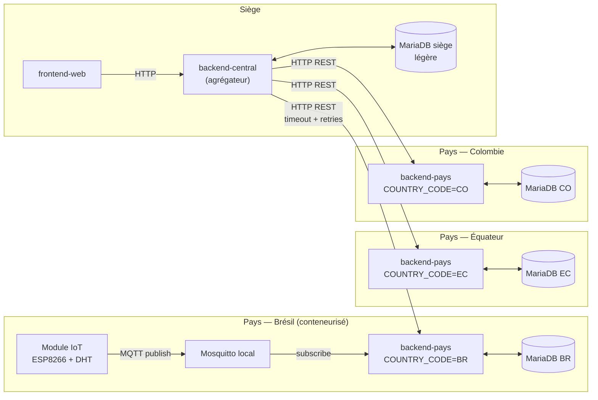

# 0001 — Architecture distribuée pays/siège

## Contexte

Le CDC impose une **architecture distribuée** (CDC « Architecture distribuée » et
« Exigences globales ») : un backend par pays, conteneurisé, et un backend siège
agrégateur. FutureKawa opère sur **≥ 3 pays** (Brésil, Équateur, Colombie), chacun
avec ses entrepôts, son module IoT et son broker MQTT local. Les contraintes
métier et techniques sont :

- **Réseau variable** entre sites et siège, matériel limité, multi-pays.
- **Isolation des pannes** : un pays indisponible ne doit ni bloquer les autres,
  ni interrompre les opérations locales de ce pays (saisie de lots, ingestion des
  mesures, alerting).
- **Conteneurisation par pays imposée** (`docker compose up`) : chaque pays doit
  pouvoir être déployé/redémarré indépendamment.
- **Traçabilité et souveraineté de la donnée** par pays.
- **Équipe de 4 apprenants** : la complexité opérationnelle doit rester maîtrisable.

Ce choix structurant débloque le schéma Prisma (ADR-0002), la convention de topics
MQTT (ADR-0003) et l'implémentation des backends.

### Options envisagées

1. **Monolithe multi-tenant** : une seule application + une seule base pour tous
   les pays, discriminés par une colonne `country`.
2. **Microservices fins** : un service par domaine (lots, mesures, alertes…)
   décliné par pays.
3. **Un backend par pays + un backend siège agrégateur** *(retenu)* : chaque pays
   est un « monolithe modulaire » autonome ; le siège consolide via HTTP.

## Décision

Nous retenons l'**option 3** : un backend autonome par pays + un backend siège.

### Backend pays (un par pays, conteneurisé)

- **Image unique** paramétrée par la variable d'environnement `COUNTRY_CODE`
  (`BR` / `EC` / `CO`), déployée en une instance par pays.
- Possède **sa propre base MariaDB** — source de vérité locale des lots, mesures
  et alertes du pays.
- Possède **son broker Mosquitto local** pour l'ingestion IoT.
- Embarque son **dispositif d'alerting** (règles de seuils + envoi d'email).
- Expose une **API REST** consommée par le siège.

### Backend central (siège)

- Interroge les backends pays **exclusivement via HTTP REST** — jamais d'accès
  direct à leurs bases de données.
- Possède une **base MariaDB légère** (authentification / utilisateurs, et
  consolidation éventuelle — détail hors scope de cet ADR).
- Expose au **frontend** des données consolidées (stocks, mesures, alertes des
  trois pays) ; le frontend est un déployable séparé (conteneur `frontend-web`)
  qui consomme **exclusivement** l'API du central.

### Flux et règle d'échange

- **Ingestion** : IoT → MQTT local → backend-pays → base pays.
- **Consultation** : Frontend → backend-central → *fan-out HTTP* → backends pays.
- **Aucun import TypeScript cross-app.** Les échanges inter-applications se font
  uniquement par **HTTP** (siège ↔ pays) ou **MQTT** (IoT → pays). Les types
  partagés transitent par `@futurekawa/contracts`, jamais par import d'app à app.

### Persistance

- **Une base MariaDB par pays** (isolation, souveraineté, aucun couplage de
  schéma entre pays) + **une base MariaDB siège légère**.
- Pas de base partagée multi-pays : chaque backend-pays est l'unique propriétaire
  de ses données.

### Indisponibilités partielles (principe)

> La résilience **détaillée** (politique de retry/backoff, circuit breaker, cache
> de consolidation, dégradation par endpoint) est traitée dans **ADR-0007**.

Au niveau du siège, l'agrégation est **best-effort** :

- Si un backend-pays est injoignable (timeout, puis retries — cf.
  `PAYS_REQUEST_TIMEOUT_MS` et `PAYS_REQUEST_RETRIES` dans `docker-compose.yml`),
  le central renvoie les données des pays **disponibles** assorties d'un
  **indicateur d'indisponibilité par pays**, plutôt que d'échouer globalement.
- Les **opérations locales d'un pays restent fonctionnelles** même si le siège
  est indisponible : la saisie de lots, l'ingestion MQTT et l'alerting d'un pays
  ne dépendent pas du central.

## Conséquences

### Positives

- **Isolation des pannes** : un pays down n'affecte ni les autres pays, ni ses
  propres opérations locales.
- **Conteneurisation par pays** conforme au CDC ; chaque pays est déployable et
  scalable indépendamment via une image unique.
- **Souveraineté et traçabilité** de la donnée par pays.
- **Découplage clair et testable** : contrats HTTP explicites, image réutilisable,
  pas de couplage de schéma.

### Négatives

- Le central porte la complexité d'**agrégation** (timeouts, retries, lectures
  potentiellement partielles).
- **Pas de transaction cross-pays** — acceptable, aucun besoin métier
  transactionnel ne traverse deux pays.
- **Duplication de l'infrastructure** (base + broker) par pays.

### Neutres / arbitrages CAP

- À l'échelle **d'un pays** : cohérence forte (transactions SQL MariaDB).
- À l'échelle **siège** : lectures orientées **AP** (disponibilité + tolérance au
  partitionnement priorisées) — les données consolidées peuvent être **partielles
  ou légèrement décalées** quand un pays est injoignable. C'est un compromis
  assumé : mieux vaut une vue partielle exploitable qu'une page d'erreur globale.

### Pourquoi pas les autres options

- **Monolithe multi-tenant rejeté** : couplage fort, pas d'isolation des pannes
  (une panne impacte tous les pays), conteneurisation indépendante par pays
  impossible proprement, base unique = point de défaillance et de contention.
- **Microservices fins rejetés** : complexité opérationnelle (déploiement,
  observabilité, communication inter-services) disproportionnée pour une équipe
  de 4 ; aucun besoin de scaler indépendamment chaque domaine. Le découpage
  **par pays** suffit à répondre aux exigences d'isolation et de déploiement.

## Références

- CDC : « Architecture distribuée » (§III.5), « Architecture globale » (§IV.4.1).
- `docker-compose.yml` (topologie de référence : `mariadb-pays`, `mariadb-central`,
  `mosquitto-pays`, `backend-pays`, `backend-central`, `frontend-web`).
- ADR liés : **ADR-0002** (persistance / Prisma), **ADR-0003** (topics MQTT),
  **ADR-0007** (résilience détaillée), **ADR-0006** (authentification).
