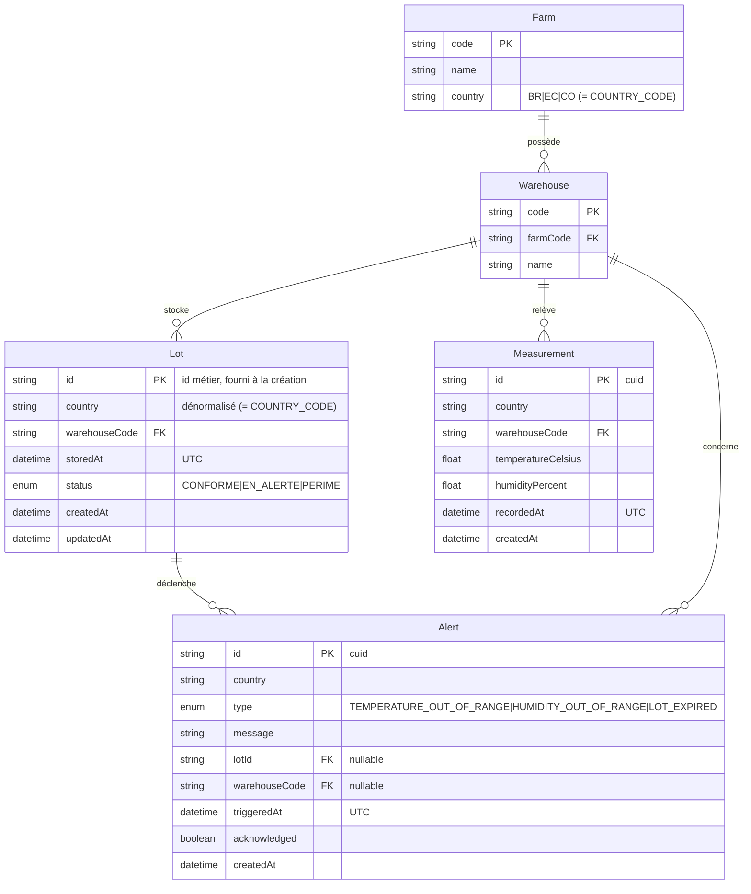
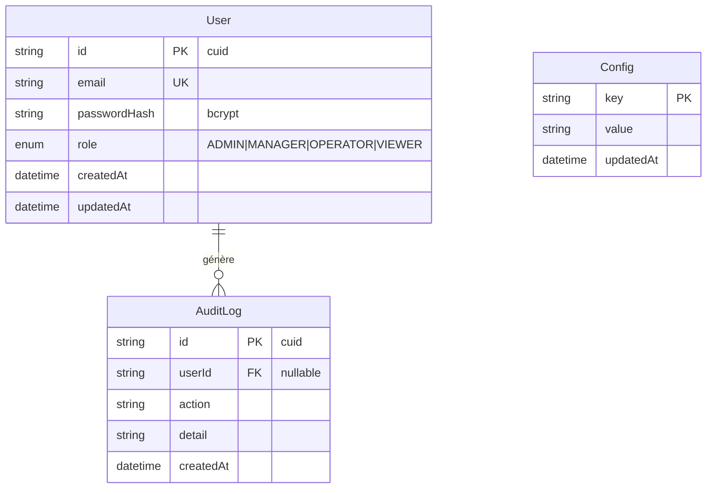

# 0002 — Schéma Prisma (pays + central)

## Contexte

Il faut figer les modèles de données **avant toute migration**. L'architecture
distribuée ([ADR-0001](0001-distributed-architecture.md)) impose **deux schémas
distincts** :

- **backend-pays** : base **opérationnelle** (lots, mesures, alertes d'un pays).
- **backend-central** : base **légère** (utilisateurs, audit, configuration siège).

Contraintes :

- Provider Prisma **`mysql`** sur **MariaDB 11.4** (cf. `docker-compose.yml`).
- Les types métier sont **déjà définis** dans `@futurekawa/contracts`
  (`Lot`, `Measurement`, `Alert`, `CountryCode`) : le schéma Prisma doit **rester
  cohérent** avec eux, jamais les contredire.
- **Une base par pays** : chaque base ne contient qu'un seul pays (déterminé par
  `COUNTRY_CODE`).
- Tri **FIFO** sur les lots (CDC §III.1) → index sur la date de stockage.

## Décision

### Schéma backend-pays (opérationnel)

Entités : `Farm`, `Warehouse`, `Lot`, `Measurement`, `Alert`.

Règles de modélisation :

- **`Lot.id`** est l'**identifiant métier** fourni à la création
  (`CreateLotDto.id`), utilisé comme **clé primaire**. Comme chaque base ne porte
  qu'un seul pays, l'unicité « par pays » du CDC équivaut à l'unicité de la PK.
- **`Farm` et `Warehouse`** sont des **tables de référence** dont la **clé
  naturelle est le `code`** (chaîne courte type `W1`, `F-BR-01`). Les contrats
  exposent `farm`/`warehouse` comme des **chaînes** : ce sont ces `code`. Le lien
  Lot→Warehouse→Farm est donc une **FK sur le `code`**, transparente côté API.
- **`country`** est **dénormalisé** sur `Lot`/`Measurement`/`Alert` même si la
  base est mono-pays : il sert la cohérence des DTO de sortie (les contrats
  portent `country`) et la traçabilité lors de l'agrégation siège.
- **Identifiants techniques** (`Measurement.id`, `Alert.id`) en **`cuid()`**
  (générés par Prisma) — non métier, non devinables.

Index & contraintes :

- **FIFO** : `@@index([storedAt])` sur `Lot` (tri par défaut `storedAt asc`),
  + `@@index([warehouseCode, storedAt])` pour le filtrage par entrepôt.
- **Mesures** : `@@index([warehouseCode, recordedAt])` (requêtes d'historique
  bornées dans le temps — cf. #29).
- **Alertes** : `@@index([type, triggeredAt])` ; la **clé de déduplication**
  (1 alerte max par entité/jour) est définie par [ADR-0004](0004-alerting-strategy.md),
  pas ici.
- **FK** : `Warehouse.farmCode → Farm.code`, `Lot.warehouseCode → Warehouse.code`,
  `Measurement.warehouseCode → Warehouse.code`, `Alert.lotId → Lot.id` (nullable).

### Schéma backend-central (léger)

Entités : `User`, `AuditLog`, `Config`. Le central **ne réplique pas** les
données opérationnelles des pays (il les consomme par HTTP — ADR-0001).

- `User.email` **unique** (`@unique`), `passwordHash` en **bcrypt** (détail du
  flow d'auth → [ADR-0006](0006-auth-strategy.md)).
- Les **rôles** et la matrice de permissions sont définis par ADR-0006 ;
  l'`enum role` ci-dessus en est le miroir de persistance.

### Types temporels & fuseau horaire

- **Stockage en UTC** systématiquement. Colonnes Prisma `DateTime` → MariaDB
  `DATETIME(3)` (précision milliseconde).
- **API** : sérialisation en **ISO-8601 avec `Z`** (cohérent avec les contrats où
  `storedAt`/`recordedAt`/`triggeredAt` sont des `string`).
- **Aucune logique de fuseau local** côté backend : la conversion d'affichage est
  une préoccupation **frontend**.

## Conséquences

### Positives

- Schémas alignés sur `@futurekawa/contracts` → pas de divergence type/DB.
- FIFO performant (index dédié), historique de mesures requêtable efficacement.
- Séparation nette pays (opérationnel) / central (léger) conforme à ADR-0001.
- UTC partout → pas d'ambiguïté de fuseau, comparaisons d'âge de lot fiables
  (péremption 365 j).

### Négatives

- **`country` dénormalisé** redondant dans une base mono-pays (assumé pour la
  cohérence des DTO et l'agrégation).
- Tables de référence `Farm`/`Warehouse` à **seeder** (cf. `prisma/seed.ts`) pour
  que les FK des lots soient satisfaites.

### Neutres

- `Lot.id` métier en PK : impose que le client fournisse un id unique — déjà prévu
  par `CreateLotDto.id`. Une collision renvoie un **409** (RFC 7807).
- Les enums (`status`, `type`, `role`) sont des **enums Prisma** miroir des unions
  TypeScript de `contracts` ; à garder synchronisés à la main (pas de génération
  croisée TS→Prisma).

## Références

- CDC : §III.1 (lots, FIFO), §III.2 (mesures).
- `@futurekawa/contracts` : `lot.ts`, `measurement.ts`, `alert.ts`, `country.ts`.
- ADR liés : [0001](0001-distributed-architecture.md) (architecture),
  [0004](0004-alerting-strategy.md) (déduplication des alertes),
  [0006](0006-auth-strategy.md) (rôles / mot de passe).
- Implémentation : `apps/backend-pays/prisma/schema.prisma` (#23),
  `apps/backend-central/prisma/schema.prisma`.
