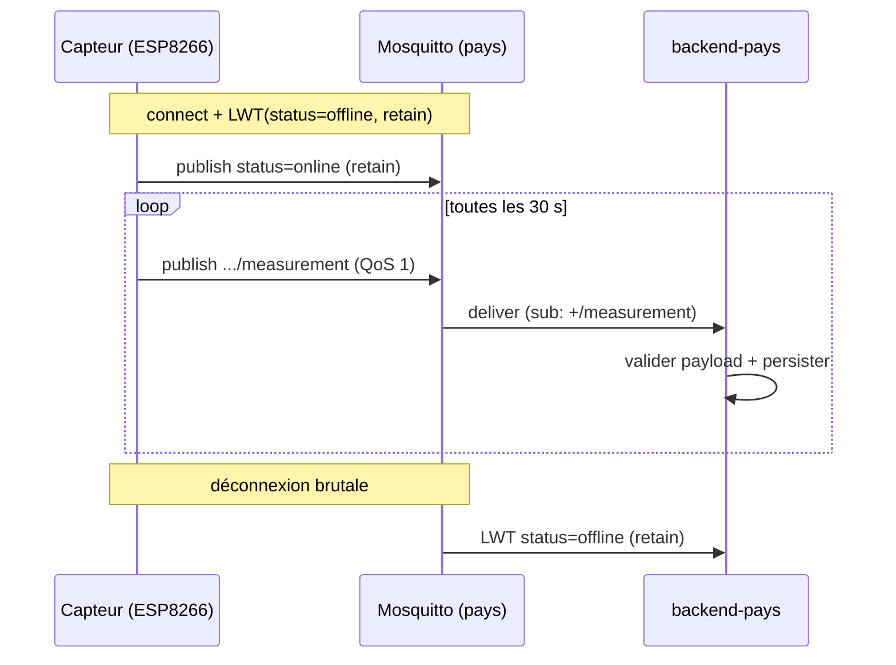

# 0003 — Convention MQTT (topics + payload)

## Contexte

Le firmware ([apps/iot](../../apps/iot/CLAUDE.md)) **publie** les relevés ; le
`backend-pays` **s'abonne** et persiste. Sans convention figée, producteur et
consommateur dérivent. Cet ADR fixe **topics, payload, QoS, retain, LWT, clientId
et fréquence**. La config du broker (`mosquitto.conf`) et l'auth MQTT sont **hors
scope** (tickets infra dédiés).

Contraintes : réseau **variable** côté terrain (CDC §III.5), capteur DHT, un
broker Mosquitto **par pays** (ADR-0001).

## Décision

### Topic de mesure

```
futurekawa/{country}/warehouse/{warehouseId}/measurement
```

- `{country}` ∈ `BR | EC | CO` (= `CountryCode` de `@futurekawa/contracts`).
- `{warehouseId}` = `code` de l'entrepôt (cf. [ADR-0002](0002-prisma-schema.md)).
- **Abonnement backend-pays** : `futurekawa/{COUNTRY_CODE}/warehouse/+/measurement`
  (wildcard `+` sur l'entrepôt). Le backend ne lit **que son propre pays**.

> Le `warehouseId` est porté par le **topic**, pas par le payload de mesure MQTT.

### Topic de statut (LWT)

```
futurekawa/{country}/warehouse/{warehouseId}/status
```

- **LWT** (Last Will & Testament) : payload `"offline"`, **`retain: true`**,
  **QoS 1**. Le broker le publie automatiquement si le capteur se déconnecte
  brutalement.
- À la connexion, le capteur publie `"online"` (même topic, `retain: true`) →
  le backend/superviseur connaît l'état courant de chaque capteur.

### Payload de mesure (JSON)

Publié sur le topic `.../measurement` :

```json
{
  "temperatureCelsius": 28.5,
  "humidityPercent": 56.2,
  "recordedAt": "2026-04-17T14:32:00Z"
}
```

Schéma (validé côté backend par `class-validator`/zod avant persistance) :

| Champ | Type | Contrainte |
|---|---|---|
| `temperatureCelsius` | number | fini, `-50..80` |
| `humidityPercent` | number | fini, `0..100` |
| `recordedAt` | string | ISO-8601 UTC (`Z`) |

- **Cohérence contrats** : ce payload correspond à `IngestMeasurementDto` de
  `@futurekawa/contracts` **moins** `warehouse` (porté par le topic en MQTT). Le
  **fallback REST `POST /api/v1/measurements`** (#28) accepte, lui, le
  `IngestMeasurementDto` complet (`warehouse` dans le body, pas de topic).
- Le backend **reconstruit** la `Measurement` en fusionnant `warehouseId` (topic)
  + `country` (`COUNTRY_CODE`) + payload.
- **Payload invalide → log `warn` + drop**, jamais de crash (cf. #28).

### QoS, retain, clientId, fréquence

| Paramètre | Valeur | Justification |
|---|---|---|
| **QoS (mesure)** | **1** (at-least-once) | Réseau variable : garantir la livraison prime sur l'unicité. Les doublons éventuels sont dédupliquables par `(warehouseCode, recordedAt)`. QoS 2 (exactly-once) jugé trop coûteux pour du capteur. |
| **retain (mesure)** | **false** | Une mesure est un **événement** horodaté, pas un état ; on ne veut pas qu'un nouvel abonné reçoive une vieille mesure « collée ». |
| **retain (status)** | **true** | L'état online/offline est un **état courant** : un abonné tardif doit le connaître. |
| **clientId** | `futurekawa-iot-{country}-{warehouseId}` | Unique par capteur → évite les évictions de session côté broker. |
| **Fréquence** | **30 s** par défaut (`PUBLISH_INTERVAL_MS`) | Compromis fraîcheur / charge réseau / usure flash. Configurable. |

### Reconnexion (côté client firmware)

- **WiFi** : backoff exponentiel plafonné (détail firmware #27).
- **MQTT** : tentative de reconnexion à chaque `loop()` si déconnecté, **sans
  `delay()` bloquant** (machine à états `millis()`).
- **Ne pas publier** tant que WiFi+MQTT ne sont pas connectés (pas de buffer
  persistant : une mesure manquée est acceptable à 30 s d'intervalle).

### Exposition dans `contracts`

Le pattern de topic est **reproduit** dans `@futurekawa/contracts` sous forme de
constante + helper (ex. `measurementTopic(country, warehouseId)`), **source unique
de vérité** partagée par le subscriber et la doc. Le firmware C++ ne consomme pas
`contracts` (ADR-0001) : le topic y est **dupliqué via `#define`**, avec un test
`pio test` garantissant le format.



## Conséquences

### Positives

- Producteur (firmware) et consommateur (backend) **alignés** sur un contrat
  unique → pas de dérive.
- Isolation par pays via le segment `{country}` + abonnement scoping.
- LWT retain → supervision simple de l'état des capteurs.
- QoS 1 → robustesse sur réseau variable.

### Négatives

- **Doublons possibles** (QoS 1) : à gérer par déduplication
  `(warehouseCode, recordedAt)` si besoin de strictement unique.
- Topic **dupliqué** entre `contracts` (TS) et firmware (`#define`) — couplage à
  maintenir, couvert par un test de format côté firmware.

### Neutres

- Auth MQTT (login/password, ACL par topic) **non traitée ici** — ticket infra
  (#10) + durcissement prod (#50).
- Pas de buffer hors-ligne côté capteur : choix assumé vu la fréquence.

## Références

- CDC : §III.2 (surveillance IoT).
- `apps/iot/CLAUDE.md`, `apps/backend-pays/CLAUDE.md` (convention MQTT).
- `@futurekawa/contracts` : `measurement.ts` (`IngestMeasurementDto`),
  `country.ts`.
- ADR liés : [0001](0001-distributed-architecture.md),
  [0002](0002-prisma-schema.md).
- Implémentation : firmware #27, subscriber #28, tests intégration #31.
