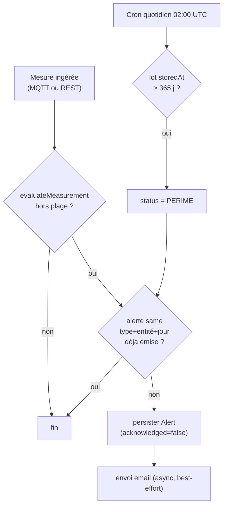

# 0004 — Stratégie d'alerting (seuils, cron, email)

## Contexte

Le CDC §III.4 impose **deux cas d'alerte** :

1. **Conditions hors plage** : T° ou humidité hors de
   `idéal ± tolérance` selon le pays.
2. **Lot trop ancien** : > **365 jours** en stockage.

**Action** : email au responsable d'exploitation du pays. Il faut figer :
déclenchement synchrone vs batch, fréquence du cron péremption, **déduplication**
(pas de spam), contenu de l'email, chemin d'**ACK**. Le provider SMTP (env) et
l'implémentation du rule engine sont hors scope.

Les **seuils** viennent **exclusivement** de `COUNTRY_CONDITIONS[COUNTRY_CODE]`
dans `@futurekawa/contracts` — jamais codés en dur.

## Décision

### Seuils (dérivés des contrats)

Pour le pays courant, plage acceptable :

```
T° ∈ [ideal − tol, ideal + tol]      humidité ∈ [ideal − tol, ideal + tol]
```

Exemple Brésil (`{29 °C, 55 %, ±3, ±2}`) → T° `[26, 32]`, humidité `[53, 57]`.
Une mesure **strictement hors** de l'intervalle (bornes incluses = OK) déclenche
respectivement `TEMPERATURE_OUT_OF_RANGE` ou `HUMIDITY_OUT_OF_RANGE`.

### Déclenchement : synchrone pour l'évaluation, asynchrone pour l'email

- **Évaluation** : **synchrone**, par un **évaluateur pur** du domain
  (`evaluateMeasurement(measurement, conditions) → Alert[]`), appelé à l'ingestion
  d'une mesure (subscriber MQTT **et** fallback REST — #32). Pur = testable sans
  infra, aucune dépendance Prisma/SMTP.
- **Persistance** de l'alerte : synchrone (DB pays).
- **Envoi d'email** : **asynchrone / best-effort**. L'échec d'envoi **ne bloque
  pas** la persistance de l'alerte ni l'ingestion. Retry léger + log `error` si
  l'email échoue ; l'alerte reste consultable via l'API/UI.



### Cron péremption

- **Fréquence** : **quotidienne** à **02:00 UTC** (`@Cron('0 2 * * *')`).
- **Justification** : la péremption est une condition **lente** (seuil de 365 j) ;
  une vérification par jour suffit largement. Heure creuse → pas de contention
  avec les pics d'ingestion.
- **Effet** : tout lot dont `storedAt` dépasse 365 j passe en `status = PERIME` et
  génère une alerte `LOT_EXPIRED` (soumise à la même déduplication).
- **Idempotence** : ré-exécuter le cron le même jour ne crée **pas** de doublon
  (cf. déduplication) et ne « re-périme » pas un lot déjà `PERIME`.

### Déduplication — 1 alerte max par entité et par jour

- **Clé de déduplication** : `(type, entité, jour calendaire UTC)` où l'entité est
  le `warehouseCode` (alertes mesure) ou le `lotId` (alerte péremption).
- **Implémentation** : **garde applicative** (vérifier l'absence d'alerte de même
  clé sur la journée avant insertion), **pas** une contrainte unique SQL — le
  bucket « par jour » + l'entité nullable rendent une contrainte MariaDB peu
  pratique. La garde s'appuie sur l'index `@@index([type, triggeredAt])`
  (ADR-0002).
- **But** : éviter le spam (une dérive qui dure → une alerte/jour, pas une toutes
  les 30 s).

### Contenu de l'email

- **Langue** : **français** (audience métier), pas d'i18n multi-langue (MSPR).
- **Format** : **HTML + fallback texte** (multipart).
- **Variables** : pays, entrepôt (et lot si `LOT_EXPIRED`), type d'alerte, valeur
  mesurée vs plage attendue, horodatage (UTC + libellé lisible), lien vers la
  fiche dans l'app.
- **Destinataire** : `ALERT_RECIPIENT` (env), **jamais** en dur.
- **Expéditeur** : `SMTP_FROM` (env).

### Chemin d'acquittement (ACK)

- **Endpoint** : `PATCH /api/v1/alerts/:id/ack` → passe `acknowledged = true`
  (l'alerte **n'est pas supprimée** : conservée pour l'historique/traçabilité).
- **UI** : action « Acquitter » dans la liste/détail des alertes (#35).
- L'ACK est **idempotent** (acquitter une alerte déjà acquittée = 200, no-op).

## Conséquences

### Positives

- Évaluateur **pur** → couverture unitaire exhaustive des seuils (BR/EC/CO,
  in-range, sur la limite, hors limite) sans infra.
- Email découplé de l'ingestion → une panne SMTP ne perd pas d'alerte.
- Déduplication → pas de spam, alertes lisibles.
- Seuils centralisés dans `contracts` → un seul endroit à faire évoluer.

### Négatives

- Garde de déduplication **applicative** (pas DB) → théoriquement sujette à une
  course concurrente ; acceptable vu le volume (mesures séquentielles par pays).
- Cron quotidien → un lot franchissant 365 j n'est marqué `PERIME` qu'au prochain
  passage (latence max ~24 h, sans impact métier réel).

### Neutres

- Pas de canal d'alerte autre que l'email (SMS/Slack hors scope MSPR).
- Le rule engine concret et le mailer sont implémentés ailleurs (#32, #33, #34).

## Références

- CDC : §III.4 (alertes automatiques), §IV.4.3 (doc des règles).
- `@futurekawa/contracts` : `country.ts` (`COUNTRY_CONDITIONS`), `alert.ts`
  (`AlertType`, `Alert`).
- ADR liés : [0002](0002-prisma-schema.md) (modèle Alert, index),
  [0003](0003-mqtt-convention.md) (source des mesures).
- Implémentation : rule engine #32, cron péremption #33, mailer #34,
  API+UI alertes #35, e2e #39.
