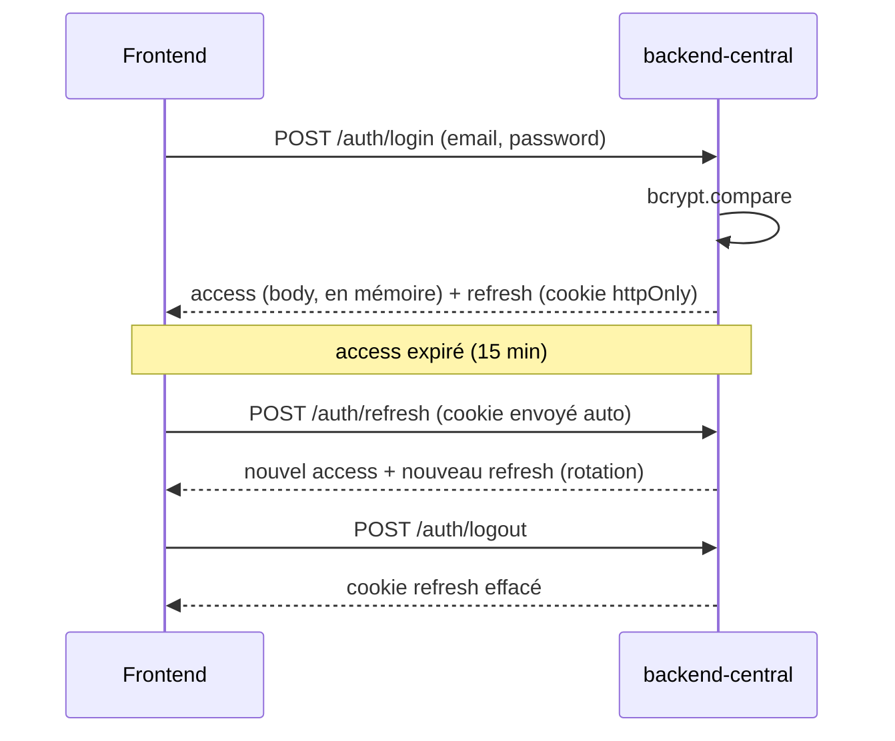

# 0006 — Stratégie d'authentification

## Contexte

Le CDC ne détaille pas l'auth, mais la plateforme sert **3 pays + un siège** et
plusieurs **rôles** métier (responsable d'exploitation, d'entrepôt, qualité). Une
**auth JWT minimale** est nécessaire pour protéger l'API et tracer les actions.
Référence sécurité : **OWASP API Security Top 10** (CDC §V.2).

Le `docker-compose.yml` fixe déjà des variables : `JWT_SECRET`,
`JWT_ACCESS_TTL=15m`, `JWT_REFRESH_TTL=7d` sur le **backend-central**.

Hors scope : SSO entreprise, MFA, CRUD utilisateurs avancé.

## Décision

### Périmètre : l'auth vit au **central**

- Le **backend-central** est la **frontière d'authentification** : il sert le
  frontend, porte la base `User` ([ADR-0002](0002-prisma-schema.md)) et émet les
  JWT (#19).
- Les **backends pays** sont appelés par le central sur le **réseau interne**
  (ADR-0001) ; ils ne gèrent pas d'utilisateurs finaux. Le durcissement de la
  liaison central↔pays (jeton de service / mTLS) relève de la **prod (#50)**.

### Flow JWT : access court + refresh long

- **Access token** : JWT signé HS256, TTL **15 min** (`JWT_ACCESS_TTL`). Porte
  `sub` (userId), `role`, `email`.
- **Refresh token** : JWT signé, TTL **7 j** (`JWT_REFRESH_TTL`), **rotation** à
  chaque rafraîchissement (un refresh consommé est ré-émis).
- **Endpoints** (#19) : `POST /api/v1/auth/login`, `POST /api/v1/auth/refresh`,
  `POST /api/v1/auth/logout`.

### Stockage côté client

- **Refresh token** : **cookie `httpOnly` + `Secure` + `SameSite=Strict`** — non
  lisible par JS (anti-XSS), non envoyé cross-site (anti-CSRF). C'est l'option
  **retenue** (recommandée par la règle 07).
- **Access token** : **en mémoire** (état React), **jamais** en `localStorage`
  ni `sessionStorage`.
- **Conséquence CSRF** : `SameSite=Strict` couvre l'usage same-origin du MSPR ; si
  un jour le front est servi sur un autre domaine que l'API, prévoir un token
  CSRF dédié (note pour #50).

### Rôles & matrice de permissions

Rôles (enum `User.role`) : `ADMIN`, `MANAGER`, `OPERATOR`, `VIEWER`.

| Action | VIEWER | OPERATOR | MANAGER | ADMIN |
|---|:---:|:---:|:---:|:---:|
| Consulter lots / mesures / alertes / dashboard | ✅ | ✅ | ✅ | ✅ |
| Créer / mettre à jour le statut d'un lot | ❌ | ✅ | ✅ | ✅ |
| Acquitter une alerte | ❌ | ✅ | ✅ | ✅ |
| Gérer le référentiel (exploitations / entrepôts) | ❌ | ❌ | ✅ | ✅ |
| Gérer les utilisateurs | ❌ | ❌ | ❌ | ✅ |

- Implémentation : `RolesGuard` Nest + décorateur `@Roles(...)` sur les routes
  protégées ; `403` (RFC 7807) si rôle insuffisant, `401` si non authentifié.

### Politique de mot de passe

- **Hash** : **bcrypt**, **cost factor 12** (`passwordHash` en base, ADR-0002).
- **Complexité minimale** : ≥ **12 caractères**, au moins une minuscule, une
  majuscule, un chiffre. Validé par `class-validator` (et zod côté front pour
  l'UX).
- **Jamais** de mot de passe en clair dans les logs (règle 08) ni dans les
  réponses API.
- **Seed** : un utilisateur **`ADMIN`** initial créé via `prisma/seed.ts`
  (identifiants par env, à changer en prod — #50).

## Conséquences

### Positives

- Conforme OWASP : pas de token en `localStorage`, refresh `httpOnly`, bcrypt,
  rotation des refresh.
- Frontière d'auth unique (central) → pays simples, pas de duplication de la
  logique d'auth.
- Matrice de rôles claire → autorisation testable (guards).

### Négatives

- Access token **en mémoire** → perdu au reload de la page ; un appel
  `/auth/refresh` au démarrage le restaure (cookie refresh persistant).
- Liaison central↔pays **non authentifiée** au niveau applicatif pour le MSPR
  (sécurité réseau interne) — durcissement renvoyé à #50.

### Neutres

- HS256 (secret partagé) suffit pour un émetteur unique (central) ; RS256
  (asymétrique) seulement utile si plusieurs services émettaient/validaient.
- Pas de MFA/SSO (hors scope).

## Références

- CDC : §V.2 (OWASP API Top 10).
- `.claude/rules/07-security.md` (cookie httpOnly, validation, pas de leak).
- `docker-compose.yml` (`JWT_SECRET`, `JWT_ACCESS_TTL`, `JWT_REFRESH_TTL`).
- ADR liés : [0001](0001-distributed-architecture.md),
  [0002](0002-prisma-schema.md) (modèle User).
- Implémentation : auth central #19, page login + protection routes #20,
  e2e login #21, durcissement prod #50.
