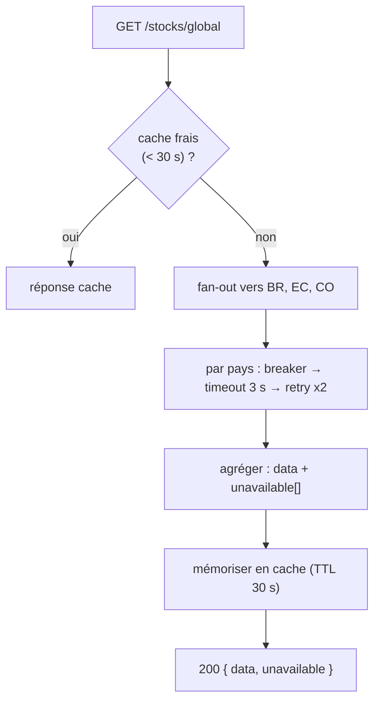

# 0007 — Résilience central ↔ pays

## Contexte

Le siège interroge les backends pays via **HTTP** sur un **réseau variable**
(CDC §III.5). [ADR-0001](0001-distributed-architecture.md) a posé le **principe**
d'agrégation best-effort et **renvoyait le détail ici**. Cet ADR fige : timeout,
retries + backoff, circuit breaker, **format de réponse partielle**, cache,
propagation du **correlation-id**.

Le `docker-compose.yml` fixe déjà `PAYS_REQUEST_TIMEOUT_MS=3000` et
`PAYS_REQUEST_RETRIES=2`. Hors scope : architecture réseau (VPN, etc.).

## Décision

Toute la résilience est concentrée dans un **port** `CountryBackendGateway` et son
adapter HTTP unique (`HttpCountryBackendGateway`, paramétré par pays — cf.
`backend-central/CLAUDE.md`).

### Timeout

- **3000 ms** par appel pays (`PAYS_REQUEST_TIMEOUT_MS`).
- **Justification** : le central sert l'UI ; il doit répondre vite. 3 s plafonne
  la latence de queue tout en tolérant un réseau lent. Au-delà → l'appel est
  considéré en échec (le pays bascule en « indisponible »).

### Retries + backoff

- **2 tentatives** supplémentaires (`PAYS_REQUEST_RETRIES`) avec **backoff
  exponentiel + jitter** (base ~200 ms : ~200 ms, ~400 ms).
- **Uniquement sur erreurs transitoires** : timeout, erreur réseau/connexion,
  `5xx`. **Jamais** de retry sur `4xx` (erreur cliente → inutile).
- Implémentation : `p-retry` ou équivalent.

### Circuit breaker (léger, par pays)

- **Ouverture** après **5 échecs consécutifs** sur un pays → les appels suivants
  **court-circuitent** (réponse « indisponible » immédiate, sans attendre le
  timeout) pendant un **cooldown de 30 s**.
- **Half-open** : après le cooldown, un appel **sonde** ; succès → fermeture,
  échec → réouverture.
- **But** : ne pas marteler un pays down ni accumuler des requêtes en timeout.

### Format de réponse partielle

Les endpoints consolidés **ne renvoient jamais 500** quand un pays manque : ils
renvoient **200** avec un champ `unavailable` listant les pays injoignables.

```jsonc
// GET /api/v1/stocks/global
{
  "data": [ /* lots/mesures/alertes des pays disponibles */ ],
  "unavailable": ["EC"]    // pays injoignables sur cette requête
}
```

- DTO de sortie dédié : `ConsolidatedResponseDto<T>` = `{ data: T[]; unavailable: CountryCode[] }`.
- Le **frontend** affiche un **bandeau « pays indisponible »** (#37) à partir de
  `unavailable`.
- `500` réservé à une **vraie** erreur du central (bug, DB siège down), pas à
  l'indisponibilité d'un pays.



### Cache

- **Cache court en mémoire** (TTL **30 s**) sur les lectures consolidées
  coûteuses (`GET /stocks/global`, dashboard) → évite de marteler les pays à
  chaque refresh front.
- **En mémoire** (pas Redis) : le central est **mono-instance** pour le MSPR.
  Redis seulement si le central est **scalé horizontalement** (note pour #50).
- **Invalidation** : par **TTL** uniquement (cohérence éventuelle assumée — les
  données consolidées peuvent avoir jusqu'à 30 s de retard, acceptable pour du
  pilotage).

### Correlation ID

- Le central **propage** le header **`x-correlation-id`** entrant vers **tous**
  les appels pays ; s'il est absent, il en **génère** un à l'entrée (règle 08).
- Présent dans **tous les logs** (central + pays) d'une même requête → traçabilité
  de bout en bout.

## Conséquences

### Positives

- L'UI reste **utilisable** même si un pays est down (vue partielle + bandeau).
- Le circuit breaker évite l'effondrement (pas d'empilement de timeouts).
- Cache → moins de charge sur les pays, refresh front fluide.
- Correlation-id → debug distribué possible.

### Négatives

- **Cohérence éventuelle** : données consolidées jusqu'à 30 s de retard (cache).
- Cache **en mémoire** non partagé → incohérent si le central est multi-instances
  (d'où la note Redis pour la mise à l'échelle).
- Complexité ajoutée au gateway (breaker + retry + cache) à tester.

### Neutres

- Pas de file d'attente / persistance des requêtes échouées (best-effort, lecture
  seule côté siège — le siège **consulte**, n'écrit pas dans les pays, ADR-0001).
- Valeurs (3 s, 2 retries, 30 s) **configurables par env** → ajustables sans
  redéploiement de code.

## Références

- CDC : §III.5 (architecture distribuée, réseau variable).
- `apps/backend-central/CLAUDE.md` (section « Agrégation & résilience »).
- `docker-compose.yml` (`PAYS_REQUEST_TIMEOUT_MS`, `PAYS_REQUEST_RETRIES`).
- ADR liés : [0001](0001-distributed-architecture.md) (principe best-effort).
- Implémentation : agrégation central #36, dashboard + bandeau indispo #37,
  durcissement/scaling prod #50.
