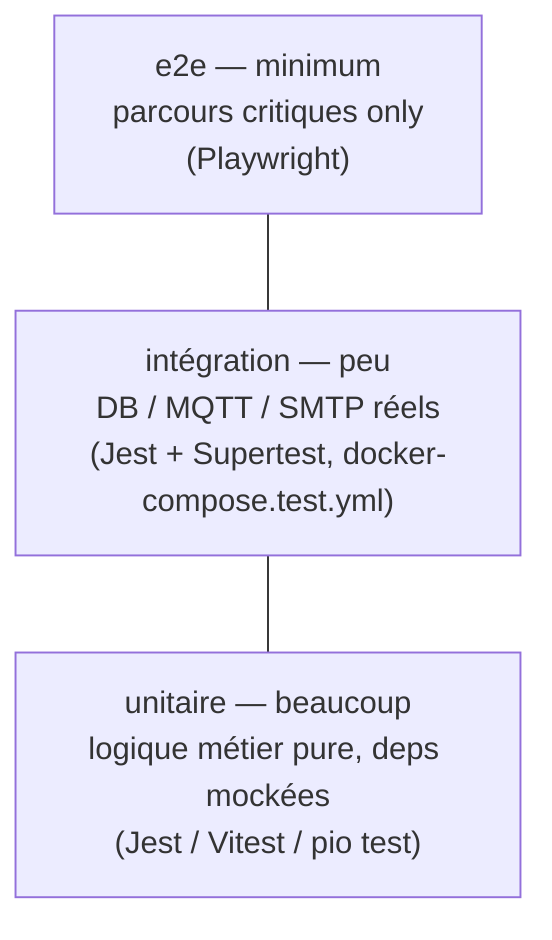

# 0008 — Stratégie de tests (pyramide, outils)

## Contexte

Le CDC §IV.4.3 impose un **plan de tests détaillé**. Il faut figer la **pyramide**,
les **outils par stack**, la **cible de couverture** sur les règles métier
critiques et la **stratégie d'isolation** (mocks vs DB/broker réels). L'écriture
des tests eux-mêmes est hors scope (tickets dédiés #26, #31, #38, #39).

Cet ADR formalise et complète la règle transverse `.claude/rules/04-tests.md`.

## Décision

### Pyramide & volumes cibles

| Niveau | Volume cible | Rôle |
|---|---|---|
| **Unitaire** | **majorité** (~70 %) | Règles métier pures, rapides, isolées, deps externes mockées. |
| **Intégration** | **modéré** (~20 %) | Traversée d'un système externe réel (DB, MQTT, mailer, HTTP client). |
| **e2e** | **minimum** (~10 %) | Parcours utilisateur critiques de bout en bout uniquement. |

### Outils par stack

| Stack | Unitaire / composant | Intégration | e2e |
|---|---|---|---|
| **backend-pays** | **Jest** (`pnpm test`) | **Jest + Supertest** (`test:e2e`) sur API + DB/MQTT réels | — |
| **backend-central** | **Jest** | **Jest + Supertest** (gateway HTTP vers pays mocké/réel) | — |
| **frontend-web** | **Vitest + @testing-library/react** ([ADR-0005](0005-frontend-stack.md)) | — | **Playwright** |
| **iot (C++)** | **`pio test`** sur la logique pure (formatage JSON, décision d'émission) | — | — |
| **parcours global** | — | — | **Playwright** (#38 FIFO, #39 alerting MQTT→email) |

### Couverture — priorités, pas un objectif chiffré global

Pas d'objectif 100 %. **Couverture exigée sur les zones critiques** :

- **Alerting** : seuils T°/humidité par pays (`COUNTRY_CONDITIONS`, in-range / sur
  la limite / hors limite pour BR/EC/CO), **déduplication**, péremption 365 j
  ([ADR-0004](0004-alerting-strategy.md)).
- **Tri FIFO** des lots (`storedAt asc`).
- **Persistance des mesures MQTT** (payload valide persisté, invalide droppé —
  [ADR-0003](0003-mqtt-convention.md)).
- **Contrats HTTP pays ↔ siège** et **réponse partielle**
  (`{ data, unavailable }` — [ADR-0007](0007-resilience-strategy.md)).

**Outillage couverture** : `jest --coverage` (`test:cov`) → `lcov.info`, remonté à
**SonarQube** par la CI (`.github/workflows/ci.yml`). Le **quality gate** évalue la
couverture du **new code** : il restera rouge tant que le code testé est quasi
inexistant (PR docs/squelette) — **comportement attendu**, qui se résorbe à mesure
que les features arrivent avec leurs tests.

### Stratégie d'isolation

- **Unitaire** : **tout mocké** (repositories, mailer, MQTT, HTTP). Le domain est
  **pur** → testable sans aucune infra (cf. évaluateur d'alertes ADR-0004).
- **Intégration** : **DB / broker / SMTP réels**, fournis par un
  **`docker-compose.test.yml`** dédié (MariaDB + Mosquitto + **MailDev** pour les
  emails). **Jamais** taper la vraie DB/broker de dev.
- **Seeds jetables** en début de suite, **cleanup** en fin. Pas d'état partagé
  entre suites.
- **Mocks de comportement, pas d'implémentation** : on teste les effets observables,
  pas les appels internes.

### Conventions (rappel + application)

- **AAA** (Arrange / Act / Assert), un comportement par test.
- **Nommage impératif anglais** : `should reject lot older than 365 days`.
- `describe('<SUT>', …)` préfixé par le nom du sujet testé.

### Anti-patterns refusés

- ❌ Supprimer un test pour le faire passer (fixer le code, ou justifier
  explicitement le changement d'assertion).
- ❌ Tolérer un test **flaky** (quarantaine temporaire + fix prioritaire).
- ❌ Mocks qui figent l'implémentation.

## Conséquences

### Positives

- Pyramide claire → effort concentré sur l'unitaire rapide, e2e réservé au
  critique → CI rapide.
- Un seul moteur par contexte (Jest backends, Vitest front) → config minimale.
- Couverture ciblée sur le métier → gate Sonar utile sans course au 100 %.
- Isolation réelle pour l'intégration → confiance sur DB/MQTT/SMTP.

### Négatives

- `docker-compose.test.yml` à maintenir (MariaDB + Mosquitto + MailDev).
- Gate Sonar rouge tant que le code testé manque (assumé, transitoire).

### Neutres

- Deux frameworks de test cohabitent (Jest côté Node, Vitest côté Vite) — normal,
  chacun aligné sur son outil de build.
- e2e exécutés en CI sur les parcours critiques uniquement (#38, #39).

## Références

- CDC : §IV.4.3 (plans de tests détaillés).
- `.claude/rules/04-tests.md` (pyramide, AAA, anti-patterns).
- `.github/workflows/ci.yml` (jobs `tests` + `sonarqube`, coverage lcov).
- ADR liés : [0002](0002-prisma-schema.md), [0003](0003-mqtt-convention.md),
  [0004](0004-alerting-strategy.md), [0005](0005-frontend-stack.md),
  [0007](0007-resilience-strategy.md).
- Implémentation : intégration lots #26, intégration mesures #31, e2e #38/#39,
  doc plans de tests #42.
