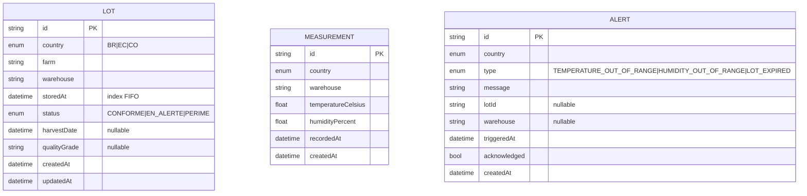
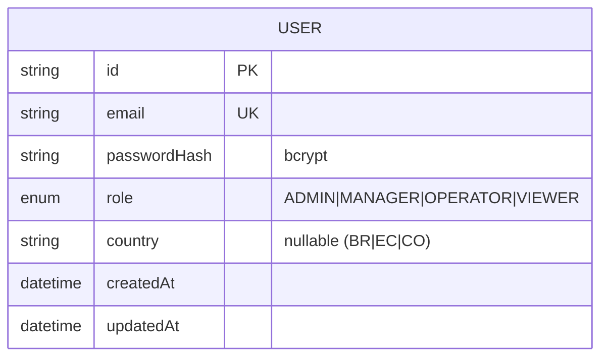

# Modèle de données

Chaque pays a **sa** base MariaDB (source de vérité locale) ; le siège a une base
**légère** dédiée aux utilisateurs (ADR-0001). Les schémas sont gérés avec
**Prisma** (provider `mysql`, driver adapter MariaDB au runtime — ADR-0002).
Source de vérité des schémas :

- `apps/backend-pays/prisma/schema.prisma`
- `apps/backend-central/prisma/schema.prisma`

> **Découplage DB ↔ API** : les modèles Prisma sont des **sur-ensembles** des
> types de `@futurekawa/contracts`. Les types Prisma ne sortent **jamais** d'un
> contrôleur — un mapper explicite traduit entité → DTO de sortie. Les `enum`
> Prisma (`Country`, `LotStatus`, `AlertType`, `Role`) sont des **miroirs** des
> unions TypeScript du package contracts, synchronisés à la main.

## Base pays

> Pas de clé étrangère matérialisée entre `Alert` et `Lot`/`Measurement` : une
> alerte référence un lot (`lotId`) ou un entrepôt (`warehouse`) de façon souple
> (les deux sont nullable selon le type d'alerte). Le lien est applicatif.

| Modèle | Table | Rôle | Index clés |
|---|---|---|---|
| `Lot` | `lots` | Lot de café vert (CDC §III.1) | `@@index([storedAt])` (FIFO), `@@unique([id, country])` |
| `Measurement` | `measurements` | Relevé T°/humidité (CDC §III.2) | `@@index([warehouse, recordedAt])` (historique) |
| `Alert` | `alerts` | Alerte métier (CDC §III.4) | `@@index([type, triggeredAt])` (dédup) |

**Règles métier portées par le modèle :**

- **FIFO** : `Lot.storedAt` indexé → tri chronologique des lots stockés.
- **Péremption** : un lot > 365 j passe `PERIME` (cron quotidien).
- **Dédup d'alerte** : 1 alerte par `type` + entité + jour UTC — applicatif,
  appuyé sur `@@index([type, triggeredAt])`.

## Base siège

| Modèle | Table | Rôle |
|---|---|---|
| `User` | `users` | Utilisateur du siège (ADR-0002, ADR-0006). Frontière d'auth **unique** : seul le central porte des utilisateurs. |

- `passwordHash` en **bcrypt**, jamais de mot de passe en clair.
- `country` nullable : `null` pour un compte siège non rattaché à un pays.

## Génération & migrations

- Le client Prisma est généré dans `src/generated/prisma` (gitignoré, régénéré au
  build). `prisma generate` n'exige **aucune** variable d'env (connexion fournie
  au runtime par le driver adapter).
- L'URL pour `prisma migrate` vient de `prisma.config.ts` (cf. ADR-0002 et le
  `CLAUDE.md` de chaque backend).
- **Diagramme ERD généré** (hors git) : régénérable via Prisma — voir la commande
  dans le `CLAUDE.md` du backend concerné. Les diagrammes ci-dessus (Mermaid)
  sont la version versionnée et diffable.

## Références

- [ADR-0002 — Schéma Prisma](../adr/0002-prisma-schema.md)
- [ADR-0006 — Stratégie d'authentification](../adr/0006-auth-strategy.md)
- Types partagés : `packages/contracts/src/`
- Vue d'ensemble : [overview.md](overview.md)
