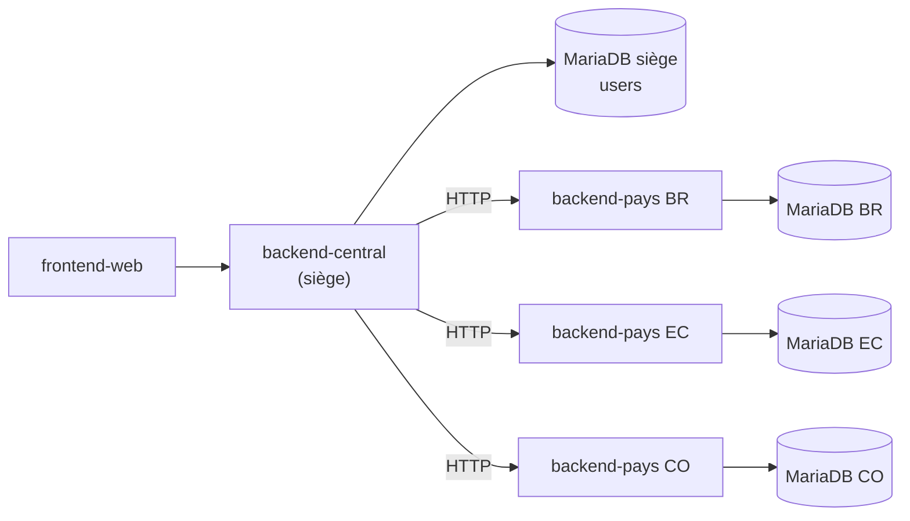
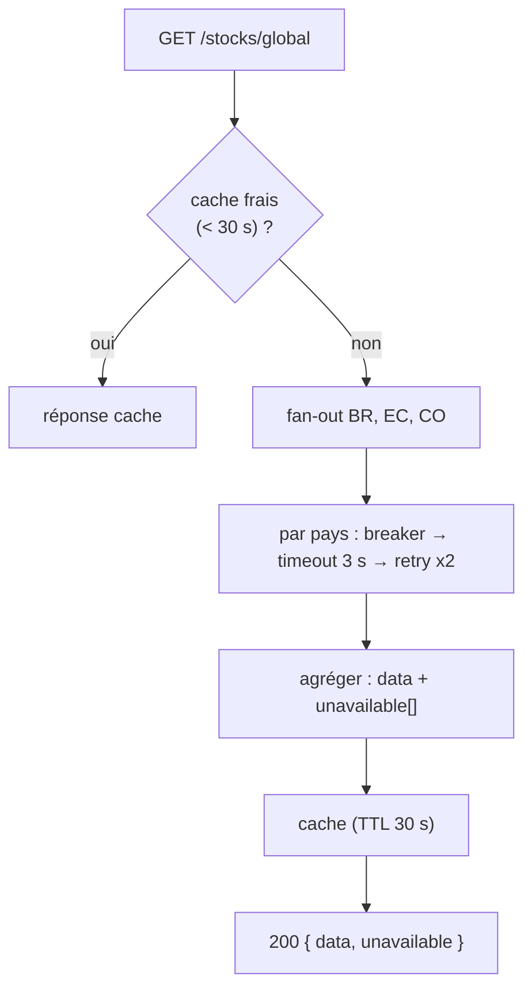

# Architecture distribuée pays ↔ siège

FutureKawa opère sur **≥ 3 pays** (Brésil, Équateur, Colombie), sur un **réseau
variable** (CDC §III.5). L'architecture est **distribuée** : un backend autonome
par pays + un backend siège agrégateur. Ce document décrit cette distribution et
la **stratégie de résilience** des échanges siège ↔ pays. Les décisions sont
figées par [ADR-0001](../adr/0001-distributed-architecture.md) (distribution) et
[ADR-0007](../adr/0007-resilience-strategy.md) (résilience).

## Pourquoi distribué

| Contrainte CDC | Conséquence architecturale |
|---|---|
| Réseau variable entre sites et siège | Échanges best-effort, pas de couplage synchrone fort |
| Isolation des pannes | Un pays down ne bloque ni les autres, ni ses opérations locales |
| Conteneurisation par pays imposée | Chaque pays déployable/redémarrable indépendamment |
| Souveraineté de la donnée par pays | Chaque pays a **sa** base, source de vérité locale |

## Topologie



### Backend pays (un par pays)

- **Image unique** paramétrée par `COUNTRY_CODE` (`BR|EC|CO`), une instance par pays.
- **Sa propre base MariaDB** : source de vérité locale (lots, mesures, alertes).
- **Son broker Mosquitto local** pour l'ingestion IoT.
- Embarque son **alerting** (seuils par pays + email).
- Expose une **API REST** consommée par le siège.

### Backend central (siège)

- Interroge les pays **exclusivement via HTTP REST** — **jamais** d'accès direct
  à leurs bases.
- Base MariaDB **légère** : utilisateurs / authentification (frontière d'auth
  unique, ADR-0006).
- Expose au frontend des données **consolidées** (stocks, mesures, alertes des 3 pays).

### Règle d'or

> **Aucun import TypeScript cross-app.** Siège ↔ pays = **HTTP**. IoT → pays =
> **MQTT**. Types partagés = `@futurekawa/contracts`. Jamais d'app qui `import`
> une autre app.

## Résilience siège ↔ pays (ADR-0007)

Toute la résilience est concentrée dans un **port** `CountryBackendGateway` et son
adapter HTTP (`apps/backend-central/src/country-backends/infrastructure/http-country-backend.gateway.ts`).



| Mécanisme | Réglage | But |
|---|---|---|
| **Timeout** | 3000 ms (`PAYS_REQUEST_TIMEOUT_MS`) | Servir l'UI vite ; au-delà → pays « indisponible » |
| **Retries** | 2 (`PAYS_REQUEST_RETRIES`), backoff exponentiel + jitter | Absorber les erreurs transitoires (timeout, réseau, 5xx) |
| **Pas de retry** | sur `4xx` | Erreur cliente → inutile de réessayer |
| **Circuit breaker** | ouvre après 5 échecs consécutifs, cooldown 30 s, half-open | Ne pas marteler un pays down |
| **Cache** | mémoire, TTL 30 s | Éviter de solliciter les pays à chaque refresh front |
| **Correlation-id** | `x-correlation-id` propagé vers les pays | Traçabilité distribuée de bout en bout |

### Réponse partielle (jamais de 500)

Les endpoints consolidés renvoient **200** avec la liste des pays injoignables :

```jsonc
// GET /api/v1/stocks/global
{
  "data": [ /* données des pays disponibles */ ],
  "unavailable": ["EC"]
}
```

- DTO : `ConsolidatedResponseDto<T>` = `{ data: T[]; unavailable: CountryCode[] }`.
- Le frontend affiche un **bandeau « pays indisponible »** à partir de `unavailable`.
- `500` est réservé à une **vraie** erreur du central (bug, DB siège down).

## Conséquences assumées

- **Cohérence éventuelle** : données consolidées jusqu'à 30 s de retard (cache).
- **Cache en mémoire** non partagé → à remplacer par Redis si le central est
  scalé horizontalement (note prod, #50).
- **Best-effort** : pas de file d'attente des requêtes échouées — le siège
  **consulte**, il n'écrit pas dans les pays.

## Références

- [ADR-0001 — Architecture distribuée](../adr/0001-distributed-architecture.md)
- [ADR-0007 — Résilience central ↔ pays](../adr/0007-resilience-strategy.md)
- Code gateway : `apps/backend-central/src/country-backends/`
- Vue d'ensemble : [overview.md](overview.md) · Conventions API : [api.md](api.md)
