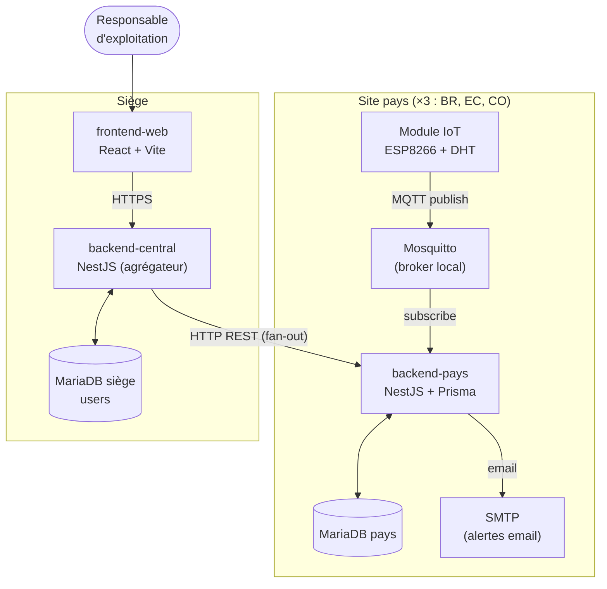
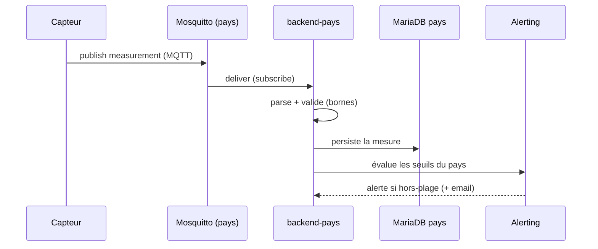
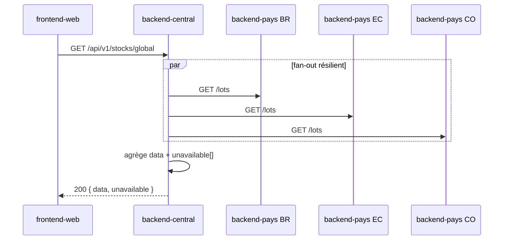

# Vue d'ensemble

FutureKawa est une solution **multi-pays** de suivi de stocks de café vert avec
surveillance IoT de la température et de l'humidité (CDC §III). Cette page donne
la vision globale : quels composants existent, qui fait quoi, et comment la
donnée circule de bout en bout.

## Composants

| Composant | Techno | Rôle | Réf |
|---|---|---|---|
| **Module IoT** | ESP8266 + DHT, C++/PlatformIO | Mesure T°/humidité, publie en MQTT | [iot/](../iot/README.md) |
| **Broker MQTT** | Mosquitto (1 par pays) | Transport des relevés capteur → backend | [mqtt.md](mqtt.md) |
| **backend-pays** | NestJS 11 + Prisma + MariaDB | API REST pays, ingestion MQTT, alerting | [distributed.md](distributed.md) |
| **backend-central** | NestJS 11 + Prisma + MariaDB | Agrégation HTTP des pays, auth, sert le front | [distributed.md](distributed.md) |
| **frontend-web** | React 19 + Vite + Tailwind + shadcn | UI siège (lots, courbes, alertes) | ADR-0005 |
| **DB pays** | MariaDB | Source de vérité locale (lots, mesures, alertes) | [database.md](database.md) |
| **DB siège** | MariaDB | Utilisateurs / auth | [database.md](database.md) |

## Trois verticales métier

La solution couvre trois domaines métier, chacun **bout-en-bout** (pays → central → front) :

| Verticale | CDC | Ce qu'elle fait |
|---|---|---|
| **Lots** | §III.1 | Création / consultation des lots de café vert, tri **FIFO**, statut, péremption 365 j |
| **Mesures** | §III.2 | Historique T°/humidité par entrepôt + agrégats (moyennes horaires/journalières) |
| **Alerting** | §III.4 | Détection seuils hors-plage (par pays) + péremption → alerte + email au responsable |

## Flux principaux

### 1. Ingestion d'une mesure (IoT → pays)

### 2. Consultation consolidée (front → siège → pays)

Le central applique timeout + retry + circuit breaker par pays et renvoie une
**réponse partielle** si un pays est injoignable (jamais de 500). Détail :
[distributed.md](distributed.md) et [ADR-0007](../adr/0007-resilience-strategy.md).

## Principes transverses

- **Aucun import cross-app** : les échanges passent par **HTTP** (siège ↔ pays) ou
  **MQTT** (IoT → pays). Les types partagés transitent par `@futurekawa/contracts`.
- **Isolation des pannes** : un pays down n'impacte ni les autres pays, ni ses
  propres opérations locales (saisie, ingestion, alerting).
- **Clean architecture** par feature et par couche (domain / application /
  infrastructure / interface) dans les backends.
- **Observabilité** : logs JSON structurés (pino) + `x-correlation-id` propagé
  de bout en bout + endpoints `/health` & `/ready`.

## Pour aller plus loin

- Distribution & résilience → [distributed.md](distributed.md)
- Modèle de données → [database.md](database.md)
- Contrat MQTT → [mqtt.md](mqtt.md) · [iot/protocol.md](../iot/protocol.md)
- Conventions API → [api.md](api.md)
