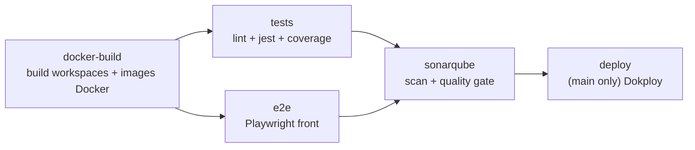

# Pipeline CI/CD — GitHub Actions

La CI/CD de FutureKawa repose sur **GitHub Actions** (workflow `Build`,
`.github/workflows/ci.yml`), **pas** sur Jenkins. Ce document décrit chaque job,
les secrets/variables nécessaires et où trouver la preuve d'exécution exigée par
le jury (CDC §IV.5).

## Déclencheurs

```yaml
on:
  push:    { branches: ['**'], tags: ['*.*.*'] }
  pull_request:
```

Le workflow tourne sur **toutes les branches** et **toutes les PR**. Le job
`deploy` ne s'exécute que sur `main`.

## Vue d'ensemble des jobs



| Job | `needs` | Rôle |
|---|---|---|
| `docker-build` | — | Build des workspaces (`pnpm -r build`) puis des **images Docker** des 3 apps. |
| `tests` | `docker-build` | `pnpm -r lint`, `pnpm -r test`, génération **coverage lcov**, upload artefact. |
| `e2e` | `docker-build` | Tests **Playwright** du front (réseau mocké), upload du rapport. |
| `sonarqube` | `tests`, `e2e` | Scan SonarQube + **Quality Gate** (consomme le coverage). |
| `deploy` | `sonarqube` | **Si `main`** : appel API Dokploy pour redéployer la stack. |

## Détail des jobs

### `docker-build` — Build des images

1. Checkout (`fetch-depth: 0` pour Sonar), Node 22, pnpm 9.15.0 (corepack).
2. `pnpm install --frozen-lockfile` puis **`pnpm -r build`**.
   > `@futurekawa/contracts` est consommé via son `dist` (gitignoré) : il **doit**
   > être buildé avant tout le reste, sinon les types ne résolvent pas.
3. Génère un `.env.compose.ci` (valeurs de CI, ports `400xx`).
4. **`docker compose --env-file .env.compose.ci build`** : valide que les 3
   Dockerfiles construisent.

### `tests` — Lint + tests + couverture

1. Install + **`pnpm -r build`** (même raison contracts).
2. **`pnpm -r lint`** (ESLint) → **`pnpm -r test`** (Jest backends + Vitest front).
3. `test:cov` par workspace → `lcov.info`, uploadés en artefact `js-ts-coverage`.

> La CI **n'exécute pas l'e2e backend** (qui exige Docker DB/MQTT/SMTP) : ces
> tests sont locaux. Voir [`../testing/strategy.md`](../testing/strategy.md).

### `e2e` — Playwright (front)

1. Install + build, résolution + cache de la version Playwright.
2. `playwright install --with-deps chromium`.
3. **`pnpm --filter frontend-web test:e2e`** (le réseau est mocké via `page.route`).
4. Upload du `playwright-report` (artefact, 7 j).

### `sonarqube` — Analyse + Quality Gate

1. Télécharge l'artefact de coverage à la racine du repo.
2. **`sonarqube-scan-action`** (env `SONAR_TOKEN`, `SONAR_HOST_URL`).
3. **`sonarqube-quality-gate-action`** (timeout 5 min) + lien vers le dashboard
   dans le résumé du run.

> 🔴 **Gate rouge tolérée** : la gate est très stricte sur le *new code*. Une PR
> de doc/squelette peut la laisser rouge sans bloquer le merge (voir politique de
> merge ci-dessous). Détail : ticket #88.

### `deploy` — Déploiement (main only)

`if: github.ref == 'refs/heads/main'` → `POST https://<dokploy>/api/compose.deploy`
avec `x-api-key` et `composeId`. Le job échoue si le code HTTP n'est pas 2xx.
Procédure complète & rollback : [`../operations/deployment.md`](../operations/deployment.md).

## Secrets & variables

| Nom | Type | Usage |
|---|---|---|
| `SONAR_TOKEN` | secret | Auth scan + quality gate |
| `SONAR_HOST_URL` | variable | URL de l'instance SonarQube |
| `DOKPLOY_API_KEY` | secret | Auth de l'appel de déploiement |
| `DOKPLOY_COMPOSE_ID` | secret | Stack compose à redéployer |

Aucun secret n'est en clair dans le dépôt (règle 07). Un scan **GitGuardian**
(GitHub App) surveille en plus les fuites de secrets sur les PR.

## Politique de merge

Merge autorisé dès que **Build Docker images + Run tests + GitGuardian** sont
verts. **SonarQube rouge est toléré** (gate custom stricte). Cette politique est
propre au contexte pédagogique du MSPR.

## Reproduire un build en local

```bash
pnpm install --frozen-lockfile
pnpm -r build
pnpm -r lint && pnpm -r test
docker compose --env-file .env.compose build   # équivaut au job docker-build
```

## Preuve d'exécution (jury)

> 📸 **À compléter (#43/#51)** : insérer une capture d'un run GitHub Actions vert
> (workflow `Build`, les 4–5 jobs au vert) et des extraits de logs significatifs
> (build des images, `pnpm -r test`, quality gate, code HTTP du job `deploy`).
> L'accès aux runs nécessite le dépôt GitHub — étape réalisée par l'équipe.

## Références

- Workflow : `.github/workflows/ci.yml`
- Images & compose : [`docker.md`](docker.md)
- Déploiement & rollback : [`../operations/deployment.md`](../operations/deployment.md)
- Stratégie de tests : [`../testing/strategy.md`](../testing/strategy.md)
