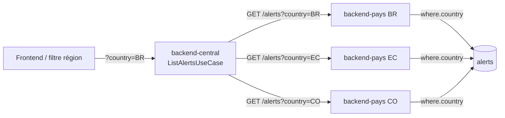

# Alertes rattachées à leur région source

## Objectif métier

Garantir qu'une alerte T°/humidité (ou péremption) émise pour **une** région/pays
n'apparaisse **que** sur cette région, jamais sur les autres. Corrige un bug de
consolidation où les alertes d'un pays (ex. BR) remontaient sur toutes les régions,
faussant l'analyse du siège. Complète la feature [`alerts.md`](./alerts.md)
(génération + persistance + ACK) côté agrégation et affichage.

Réf. ticket : [#144](https://github.com/Enzobu/MSPR-TPRE-814/issues/144).

## Scope

**Inclus :**
- Scope par pays du fetch d'alertes du siège vers chaque backend pays.
- Filtre `country` de bout en bout (siège → pays → repository Prisma).
- Filtre + rattachement visuel de la région côté frontend (colonne/badge, filtre URL).
- Test de non-régression : BR en alerte, EC/CO sans alerte.

**Hors scope :**
- Modification des seuils T°/humidité (restent dans `@futurekawa/contracts`).
- Refonte de l'alerting email et création de nouveaux types d'alerte.

## Cause racine

En démo mono-instance, les 3 URLs `BACKEND_PAYS_{BR,EC,CO}_URL` pointent vers une
**même** instance backend-pays (1 DB multi-pays). Le siège fan-out sur les 3 pays
avec un chemin **non scopé** (`GET /api/v1/alerts` sans `country`) : chaque appel
renvoyait donc **toutes** les alertes, d'où triplication + fuite inter-régions.
Même schéma que le fix lots [#140](https://github.com/Enzobu/MSPR-TPRE-814/issues/140)
(`fix(central): scope per-country lot fetch`). En déploiement réel (1 instance par
pays), le filtre est sans effet — l'instance ne détient qu'un pays.

## Parcours utilisateur

- En tant qu'utilisateur du siège, je vois pour chaque alerte sa région source.
- En tant qu'utilisateur du siège, je peux filtrer les alertes par région (URL
  bookmarkable) pour ne voir que celles d'un pays.

## Règles métier

- Chaque `Alert` porte un `country: CountryCode` non ambigu, préservé de la
  génération pays jusqu'au DTO siège et à l'affichage.
- `country` absent = consolidation des trois pays (comportement par défaut).
- Aucune alerte ne doit apparaître pour un pays qui ne l'a pas émise.

## Contrats API / MQTT

| Type | Contrat | Fichier |
|---|---|---|
| REST (pays) | `GET /api/v1/alerts?country=BR` | [`alerts.controller.ts`](../../apps/backend-pays/src/alerts/interface/alerts.controller.ts) |
| REST (siège) | `GET /api/v1/alerts?country=BR` | [`alerts.controller.ts`](../../apps/backend-central/src/alerts/interface/alerts.controller.ts) |
| Types | `Alert`, `CountryCode` | [`alert.ts`](../../packages/contracts/src/alert.ts) |

Swagger : `/api-docs#/alerts`. Bruno : `bruno/pays/alerts/list-alerts.bru`,
`bruno/central/alerts/list.bru` (param `country`).

## Architecture technique

Le siège construit **un chemin par pays** (`buildPath(params, country)`), chacun
scopé. Fusion + tri `triggeredAt` desc + pagination inchangés ; un pays down tombe
dans `unavailable` (jamais 500, ADR-0007).

## Implémentation

- **backend-pays** — filtre `country` :
  - Interface : [`list-alerts-query.dto.ts`](../../apps/backend-pays/src/alerts/interface/dto/list-alerts-query.dto.ts)
  - Application : [`list-alerts.use-case.ts`](../../apps/backend-pays/src/alerts/application/list-alerts.use-case.ts)
  - Domain (port) : [`alert.repository.ts`](../../apps/backend-pays/src/alerts/domain/alert.repository.ts)
  - Infra : [`prisma-alert.repository.ts`](../../apps/backend-pays/src/alerts/infrastructure/prisma-alert.repository.ts)
- **backend-central** — scope par pays : [`list-alerts.use-case.ts`](../../apps/backend-central/src/alerts/application/list-alerts.use-case.ts) (`buildPath`)
- **frontend** :
  - Filtre : [`CountryFilter.tsx`](../../apps/frontend-web/src/features/alerts/components/CountryFilter.tsx)
  - Rattachement visuel : [`AlertsTable.tsx`](../../apps/frontend-web/src/features/alerts/components/AlertsTable.tsx), [`AlertCard.tsx`](../../apps/frontend-web/src/features/alerts/components/AlertCard.tsx)
  - État URL : [`useAlertFilters.ts`](../../apps/frontend-web/src/features/alerts/hooks/useAlertFilters.ts)

## Tests

| Niveau | Fichier | Couvre |
|---|---|---|
| Unit (pays) | `apps/backend-pays/src/alerts/infrastructure/prisma-alert.repository.spec.ts` | `where.country` scopé |
| Unit (siège) | `apps/backend-central/src/alerts/application/list-alerts.use-case.spec.ts` | chemin scopé par pays + BR-only, EC/CO sans alerte |
| UI | `apps/frontend-web/tests/features/alerts/components/CountryFilter.test.tsx` | filtre région |
| UI | `apps/frontend-web/tests/features/alerts/components/AlertsTable.test.tsx` | région source affichée |

## Documentation utilisateur

Voir [`../user/alerts.md`](../user/alerts.md) (compréhension et actions sur les alertes).

## Évolutions / TODO

- [ ] Vue « par région » dédiée (croisée avec la feature relevés #143).
