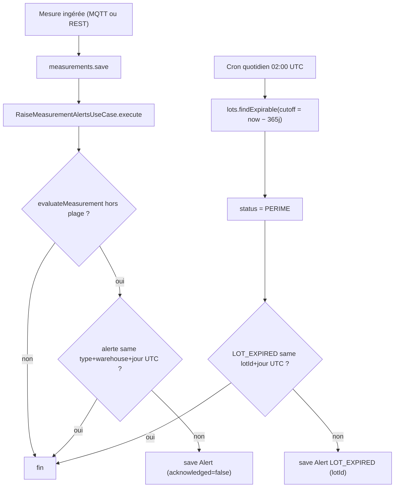

# Alertes T°/humidité

## Objectif métier

Détecter automatiquement, à chaque relevé ingéré, qu'un entrepôt sort des
conditions de conservation idéales du café vert (T° ou humidité hors plage selon
le pays) et matérialiser une **alerte** persistée, consultable et actionnable
(ACK). Couvre le premier cas d'alerte du CDC §III.4 (conditions hors plage).

## Scope

**Inclus (#32) :**
- Évaluateur **pur** des seuils T°/humidité.
- Persistance des alertes `TEMPERATURE_OUT_OF_RANGE` / `HUMIDITY_OUT_OF_RANGE`.
- **Déduplication** : 1 alerte max par `(type, entrepôt, jour UTC)`.
- Branchement sur l'ingestion des mesures (MQTT #28 + fallback REST).

**Inclus (#33) — péremption :**
- Cron quotidien (02:00 UTC) qui marque les lots > 365 j en `PERIME`.
- Alerte `LOT_EXPIRED` dédupliquée par `(lotId, jour UTC)`, idempotente.

**Hors scope (autres tickets) :**
- Envoi d'email au responsable (#34) — l'alerte `LOT_EXPIRED` est persistée, le
  branchement email viendra avec #34.
- API / UI de consultation et d'ACK des alertes (#35).

## Règles métier

- Seuils **exclusivement** depuis `COUNTRY_CONDITIONS[country]` de
  `@futurekawa/contracts` — jamais codés en dur (ADR-0004).
- Plage acceptable = `[ideal − tol, ideal + tol]`, **bornes incluses = OK**.
  Strictement hors → alerte.
- Une mesure peut lever **0, 1 ou 2** alertes (T° et/ou humidité).
- **Déduplication** : garde applicative (vérifier l'absence avant insert),
  fenêtre = journée calendaire **UTC** du moment courant. Pas de contrainte SQL,
  s'appuie sur l'index `@@index([type, triggeredAt])`.
- Entité de référence pour les alertes mesure = `warehouse`.
- Messages FR clairs incluant la valeur et la plage (ex.
  « Température 35°C hors plage [26;32] »).

### Péremption (cron — #33)

- **Source de la règle** : `LOT_MAX_AGE_DAYS = 365` dans
  `@futurekawa/contracts` (`lot.ts`) — jamais codé en dur ailleurs (ADR-0004).
- **Fréquence** : quotidienne à **02:00 UTC** (`@Cron('0 2 * * *')`, heure
  creuse).
- **Condition** : un lot dont `storedAt` dépasse **strictement** 365 j (donc
  périmé à partir de 366 j ; 365 j pile = pas encore périmé) et **non déjà
  `PERIME`** passe en `status = PERIME`.
- **Alerte** : génère une alerte `LOT_EXPIRED` (`lotId` renseigné), message FR
  (« Lot &lt;id&gt; périmé : stocké depuis plus de 365 jours »).
- **Déduplication** : entité = **`lotId`** (pas l'entrepôt), fenêtre = journée
  calendaire **UTC**. Garde applicative `existsForLotOnDay`.
- **Idempotence** : ré-exécuter le cron le même jour ne crée pas de 2e alerte et
  ne « re-périme » pas (les lots déjà `PERIME` sont exclus du scan). Best-effort
  par lot : une erreur sur un lot n'interrompt pas le scan des autres.

## Modèle de données

Modèle Prisma `Alert` (`alerts`) — voir
[`../architecture/database.md`](../architecture/database.md) et
[ADR-0002](../adr/0002-prisma-schema.md) :

| Champ | Type | Note |
|---|---|---|
| `id` | `String @id @default(cuid())` | |
| `country` | `Country` | enum réutilisé |
| `type` | `AlertType` | nouvel enum miroir de contracts |
| `message` | `String` | FR, valeur + plage |
| `lotId` | `String?` | renseigné par #33 |
| `warehouse` | `String?` | renseigné pour les alertes mesure |
| `triggeredAt` | `DateTime` | |
| `acknowledged` | `Boolean @default(false)` | |
| `createdAt` | `DateTime @default(now())` | audit |

Index `@@index([type, triggeredAt])` (support de la dédup).

## Contrats API / MQTT

Pas de nouvelle route : l'alerting est déclenché par l'ingestion existante
(MQTT `futurekawa/{country}/warehouse/{id}/measurement` + `POST /api/v1/measurements`).
L'API de consultation des alertes est traitée en #35.

| Type | Contrat | Fichier |
|---|---|---|
| Types | `Alert`, `AlertType`, `CountryConditions` | `packages/contracts/src/alert.ts`, `country.ts` |
| Constante | `LOT_MAX_AGE_DAYS` (péremption #33) | `packages/contracts/src/lot.ts` |
| Cron | `@Cron('0 2 * * *')` (péremption #33) | `apps/backend-pays/src/alerts/infrastructure/lot-expiration.cron.ts` |

## Architecture technique

L'évaluation tourne **synchrone** après chaque persistance de mesure, en
**best-effort** : un échec d'alerting ne fait jamais échouer l'ingestion.

## Implémentation

- **Domain** :
  - `apps/backend-pays/src/alerts/domain/alert.ts` (`Alert`, `NewAlert`)
  - `apps/backend-pays/src/alerts/domain/alert-rule.ts` (évaluateur pur)
  - `apps/backend-pays/src/alerts/domain/alert.repository.ts` (port,
    `existsForWarehouseOnDay` + `existsForLotOnDay`)
  - `apps/backend-pays/src/alerts/domain/lot-expiration.ts` (`expirationCutoff`,
    `isLotExpired`, purs — #33)
  - `apps/backend-pays/src/alerts/domain/day.ts` (`startOfDayUtc`, partagé)
- **Application** :
  - `apps/backend-pays/src/alerts/application/raise-measurement-alerts.use-case.ts`
  - `apps/backend-pays/src/alerts/application/expire-lots.use-case.ts` (#33)
- **Infrastructure** :
  - `apps/backend-pays/src/alerts/infrastructure/prisma-alert.repository.ts`
  - `apps/backend-pays/src/alerts/infrastructure/lot-expiration.cron.ts` (#33)
- **Wiring ingestion** : `AlertsModule` exporte `RaiseMeasurementAlertsUseCase`,
  importé par `MeasurementsModule` ; `IngestMeasurementUseCase` l'appelle après
  `save` (try/catch + log `warn`).
- **Wiring péremption (#33)** : `ScheduleModule.forRoot()` dans `AppModule` ;
  `AlertsModule` importe `LotsModule` (qui exporte `LOT_REPOSITORY`) et fournit
  `ExpireLotsUseCase` + `LotExpirationCron`. `LotsModule` n'importe pas
  `AlertsModule` (pas de cycle).

## Tests

| Niveau | Fichier | Couvre |
|---|---|---|
| Unit | `apps/backend-pays/src/alerts/domain/alert-rule.spec.ts` | seuils BR/EC/CO, bornes, messages |
| Unit | `apps/backend-pays/src/alerts/application/raise-measurement-alerts.use-case.spec.ts` | dédup + in-range |
| Unit | `apps/backend-pays/src/measurements/application/ingest-measurement.use-case.spec.ts` | best-effort alerting |
| Unit | `apps/backend-pays/src/alerts/domain/lot-expiration.spec.ts` | limite 365 j (364/365/366/400) |
| Unit | `apps/backend-pays/src/alerts/application/expire-lots.use-case.spec.ts` | péremption + idempotence + best-effort |
| Intégration | `apps/backend-pays/test/alerting.e2e-spec.ts` | persistance + dédup via REST, DB réelle |
| Intégration | `apps/backend-pays/test/expiration.e2e-spec.ts` | cron péremption + idempotence, DB réelle |

## Évolutions / TODO

- [x] #33 — cron péremption (lots > 365j → `LOT_EXPIRED`).
- [ ] #34 — envoi d'email best-effort au responsable.
- [ ] #35 — API/UI de consultation et d'ACK des alertes.
