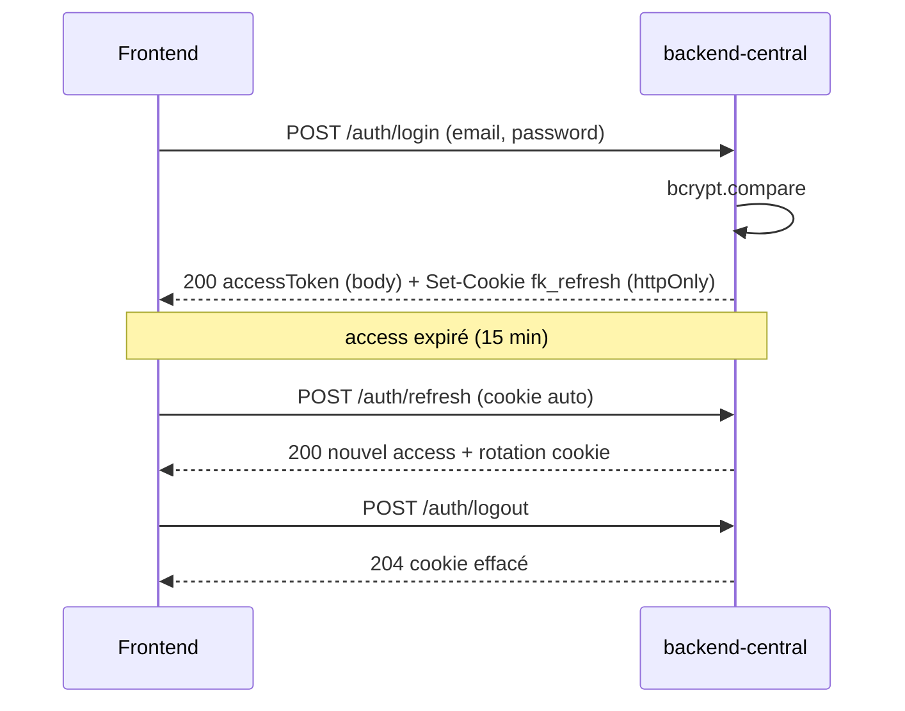

# Authentification

## Objectif métier

Protéger l'API du siège et tracer les actions des utilisateurs (responsables
d'exploitation, d'entrepôt, qualité). Le backend-central est la **frontière
d'authentification unique** : il porte les comptes et émet les JWT. Couvre le
besoin sécurité du CDC §V.2 (OWASP API Top 10).

## Scope

**Inclus :**
- Modèle `User` (DB siège) + seed d'un compte `ADMIN`.
- `POST /auth/login`, `POST /auth/refresh`, `POST /auth/logout`, `GET /auth/me`.
- Access token JWT (15 min, body) + refresh token (7 j, cookie httpOnly, rotation).
- Gardes `JwtAuthGuard` + `RolesGuard` (`@JwtAuth(...roles)`) prêtes à protéger
  les futures routes métier.

**Hors scope :**
- CRUD utilisateurs / inscription self-service (ticket ultérieur).
- Révocation serveur des refresh tokens (denylist) → durcissement prod (#50).
- Auth de la liaison central ↔ pays (#50). MFA / SSO (hors projet).

## Parcours utilisateur

- En tant qu'utilisateur du siège, je veux m'authentifier avec email/mot de
  passe afin d'accéder aux données consolidées.
- En tant qu'utilisateur connecté, je veux rester connecté au-delà de 15 min
  sans ressaisir mes identifiants (refresh transparent).
- En tant qu'utilisateur, je veux me déconnecter (effacement du refresh).

## Règles métier

- **Mot de passe** : bcrypt cost 12. Politique de complexité (≥ 12 car., 1 min/1
  maj/1 chiffre — ADR-0006) appliquée à la *création* d'un compte (ticket futur)
  et côté front (zod, #20) ; le login ne valide que la taille (12–128) pour ne
  pas divulguer la politique.
- **Access token** : HS256, TTL 15 min, claims `sub`/`email`/`role`/`country`.
  Stocké **en mémoire** côté client, jamais en `localStorage`.
- **Refresh token** : HS256, TTL 7 j, cookie `fk_refresh` httpOnly + `Secure`
  (prod) + `SameSite=Strict`, path `/api/v1/auth`. **Rotation** à chaque refresh.
- **Erreurs génériques** : identifiants invalides → `401` sans distinguer
  email inconnu / mauvais mot de passe (anti-énumération, OWASP).
- **Rôles** : `ADMIN | MANAGER | OPERATOR | VIEWER` (matrice ADR-0006). `401` si
  non authentifié, `403` (RFC 7807) si rôle insuffisant.

## Modèle de données

`User` (DB siège) : `id` (cuid), `email` (unique), `passwordHash` (bcrypt),
`role` (enum), `country?`, timestamps. Voir
[`../architecture/database.md`](../architecture/database.md) et
[ADR-0002](../adr/0002-prisma-schema.md).

## Contrats API / Types

| Type | Contrat | Fichier |
|---|---|---|
| REST | `POST /api/v1/auth/login` | [`auth.controller.ts`](../../apps/backend-central/src/auth/interface/auth.controller.ts) |
| REST | `POST /api/v1/auth/refresh` | idem |
| REST | `POST /api/v1/auth/logout` | idem |
| REST | `GET /api/v1/auth/me` | idem |
| Types | `Role`, `AuthenticatedUser`, `LoginRequest`, `AuthResponse` | [`auth.ts`](../../packages/contracts/src/auth.ts) |

Swagger : `/api-docs#/auth`. Bruno : [`bruno/central/auth/`](../../bruno/central/auth/).

## Architecture technique

Clean archi (dependency rule ADR-0001) : les use-cases parlent aux ports
(`UserRepository`, `PasswordHasher`, `TokenService`), l'infra les implémente
(Prisma, bcrypt, `@nestjs/jwt`). Le secret `JWT_SECRET` est **requis au boot**.

## Implémentation

- **Domain** : [`src/auth/domain/`](../../apps/backend-central/src/auth/domain/) — ports + entité + erreurs.
- **Application** : [`src/auth/application/`](../../apps/backend-central/src/auth/application/) — `login`, `refresh-token`.
- **Infrastructure** : [`src/auth/infrastructure/`](../../apps/backend-central/src/auth/infrastructure/) — Prisma repo, bcrypt, JWT.
- **Interface** : [`src/auth/interface/`](../../apps/backend-central/src/auth/interface/) — controller, DTO, gardes, décorateurs.
- **Seed** : [`prisma/seed.ts`](../../apps/backend-central/prisma/seed.ts).

## Tests

| Niveau | Fichier | Couvre |
|---|---|---|
| Unit | `src/auth/application/login.use-case.spec.ts` | identifiants invalides, émission |
| Unit | `src/auth/application/refresh-token.use-case.spec.ts` | rotation, user disparu |
| Unit | `src/auth/infrastructure/bcrypt-password-hasher.spec.ts` | hash / compare |
| Unit | `src/auth/infrastructure/jwt-token.service.spec.ts` | claims, access≠refresh, mauvais secret |
| Unit | `src/auth/interface/guards/*.spec.ts` | 401 / 403 / attache user |
| Unit | `src/auth/interface/refresh-cookie.spec.ts` | options cookie durcies |
| Intégration | `test/auth.e2e-spec.ts` | login/me/refresh/logout contre une vraie DB |

> L'e2e d'intégration nécessite MariaDB up + migration appliquée. Le scénario
> Playwright (#21) couvrira le parcours UI complet.

## Documentation utilisateur

À écrire avec l'UI (#20) : [`../user/`](../user/).

## Évolutions / TODO

- [ ] CRUD utilisateurs + application de la politique de complexité à la création.
- [ ] Révocation serveur des refresh tokens (denylist) — #50.
- [ ] Durcissement liaison central ↔ pays — #50.
