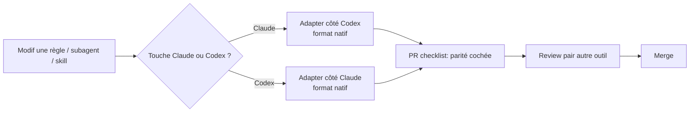

# Parité Claude Code ↔ Codex

## Objectif métier

L'équipe FutureKawa est mixte : certains membres travaillent avec **Claude Code**, d'autres avec **Codex**. Pour éviter toute divergence de qualité ou de pratique selon l'outil, le repo expose **deux configurations sémantiquement équivalentes** — règles, subagents, skills, fichiers de contexte — au format natif de chaque outil, et impose la synchronisation à chaque PR.

Issue source : [#53](https://github.com/Enzobu/MSPR-TPRE-814/issues/53).

## Scope

**Inclus :**
- 6 × `AGENTS.md` (racine + 5 sous-projets), miroirs sémantiques des 6 × `CLAUDE.md`
- `.codex/config.toml` (TOML) ≡ `.claude/settings.json` (JSON)
- `.codex/agents/*.toml` × 7 (TOML) ≡ `.claude/agents/*.md` × 7 (markdown)
- `.agents/skills/<nom>/SKILL.md` × 9 (dossiers) ≡ `.claude/commands/*.md` × 9 (fichiers)
- `.codex/rules/` × 10 ≡ `.claude/rules/` × 10 (10 = nouvelle règle `10-ai-parity.md`)
- `.gitignore` pour `.codex/settings.local.{toml,json}` et `.claude/settings.local.json`
- Règle transverse `10-ai-parity.md` dans les deux `rules/`
- Case de vérification parité dans `PULL_REQUEST_TEMPLATE.md`
- `docs/operations/ai-assistants.md` (mode d'emploi)
- `README.md` racine mentionne les deux assistants

**Hors scope :**
- Divergences fonctionnelles entre Claude et Codex (chaque outil garde ses spécificités natives).
- Script de génération automatique cross-config (à évaluer plus tard).
- Configuration IDE ou plugins spécifiques à chaque assistant (reste personnel).

## Parcours utilisateur

- En tant que **membre de l'équipe Codex**, je veux que `AGENTS.md` et `.codex/` me fournissent le même cadre que mes collègues Claude, au format natif que Codex comprend.
- En tant que **mainteneur**, je veux qu'une règle forte impose la synchro à chaque PR touchant l'un ou l'autre univers.

## Règles métier

- **Parité sémantique** : mêmes expertises, mêmes règles, mêmes workflows. La syntaxe peut différer (TOML vs JSON vs Markdown) mais le comportement attendu doit être identique.
- **Synchronisation en un seul PR** : modifier un côté sans l'autre = PR pas prête.
- **Validation croisée** : review par un pair utilisant l'autre assistant.

## Architecture technique

```
repo/
├── CLAUDE.md              ← lu par Claude Code
├── AGENTS.md              ← lu par Codex (hierarchical)
├── apps/*/
│   ├── CLAUDE.md
│   └── AGENTS.md
├── packages/contracts/
│   ├── CLAUDE.md
│   └── AGENTS.md
├── .claude/               ← config Claude Code
│   ├── settings.json
│   ├── rules/ × 10        (*.md)
│   ├── agents/ × 7        (*.md)
│   └── commands/ × 9      (*.md)
├── .codex/                ← config Codex (format natif)
│   ├── config.toml        (TOML, pas JSON)
│   ├── rules/ × 10        (*.md — reference docs, chargés via skill rules)
│   └── agents/ × 7        (*.toml avec name/description/developer_instructions)
└── .agents/               ← skills Codex (emplacement officiel)
    └── skills/ × 9
        └── <nom>/SKILL.md  (un dossier par skill, frontmatter name + description)
```

Flux d'édition (PR) :



## Implémentation

### Ce qui diffère vraiment (syntaxe native)

| Élément | Claude | Codex |
|---|---|---|
| Subagent frontmatter | YAML dans `.md` | Clés TOML `name`, `description`, `developer_instructions` |
| Skill / command wrapper | `.claude/commands/xxx.md` (fichier unique) | `.agents/skills/xxx/SKILL.md` (dossier) |
| Permissions | `settings.json` allow/ask/deny | `config.toml` `approval_policy` + `sandbox_mode` |

### Sources documentaires Codex
- [AGENTS.md](https://developers.openai.com/codex/guides/agents-md)
- [Config basics](https://developers.openai.com/codex/config-basic)
- [Subagents](https://developers.openai.com/codex/subagents)
- [Agent Skills](https://developers.openai.com/codex/skills)

## Tests

| Niveau | Fichier | Couvre |
|---|---|---|
| Validation manuelle | — | Diff `.claude/` vs `.codex/` vs `.agents/skills/` : même nombre d'artefacts, parité sémantique vérifiée par lecture |
| Validation croisée | — | Un membre Codex exécute une skill clé (`create-ticket`, `feature`) → même comportement qu'un collègue Claude sur la slash command équivalente |
| Pre-PR | PR checklist | Case "Config Claude/Codex synchronisées" cochée |

## Documentation utilisateur

N/A — pas une feature métier.

## Évolutions / TODO

- [ ] Script `scripts/check-ai-parity.sh` vérifiant la parité structurelle (count équivalent des deux côtés).
- [ ] Intégrer ce check dans la pipeline CI retenue.
- [ ] Documenter en continu les éventuels gaps (feature supportée par un outil pas par l'autre).
