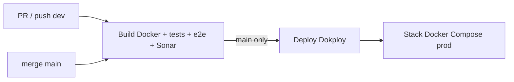

# Déploiement CI/CD

## Objectif métier

Garantir que FutureKawa peut être construit, testé et déployé de manière
reproductible avant la soutenance. Le CDC §IV.5 demande une pipeline CI/CD
automatisée et une preuve d'exécution exploitable par le jury.

## Scope

**Inclus :**
- Pipeline GitHub Actions `Build` : build Docker, lint/tests, e2e front,
  SonarQube, déploiement Dokploy sur `main`.
- Documentation de déploiement local et production.
- Preuve d'exécution d'un run vert avec artefacts et log `Deploy`.
- Procédure de rollback et test non destructif du revert Git.

**Hors scope :**
- Description exhaustive des images Docker, couverte par [`../ci-cd/docker.md`](../ci-cd/docker.md).
- Durcissement production complet, suivi par les tickets sécurité dédiés.

## Parcours utilisateur

- En tant que membre de l'équipe, je veux déployer en suivant une procédure
  documentée afin de livrer une version stable sans action implicite.
- En tant que jury, je veux voir un run CI/CD vert et une preuve du job
  `Deploy` afin de vérifier que l'exigence §IV.5 est couverte.

## Règles métier

- Les PR passent par `dev` avec CI verte et review.
- Seule la branche `main` déclenche le job `Deploy`.
- Les secrets CI/CD restent dans GitHub Actions et Dokploy, jamais dans le dépôt.
- Un rollback passe par une PR de revert quand GitHub est disponible.

## Modèle de données

Non applicable : cette feature ne modifie ni Prisma ni les contrats métier.

## Contrats API / MQTT

| Type | Contrat | Fichier |
|---|---|---|
| CI/CD | Workflow GitHub Actions `Build` | [`../../.github/workflows/ci.yml`](../../.github/workflows/ci.yml) |
| Déploiement | `POST /api/compose.deploy` Dokploy | [`../operations/deployment.md`](../operations/deployment.md) |

## Architecture technique

## Implémentation

- Workflow : [`../../.github/workflows/ci.yml`](../../.github/workflows/ci.yml)
- Pipeline : [`../ci-cd/github-actions.md`](../ci-cd/github-actions.md)
- Déploiement et rollback : [`../operations/deployment.md`](../operations/deployment.md)
- Images et compose : [`../ci-cd/docker.md`](../ci-cd/docker.md)

## Tests

| Niveau | Fichier / preuve | Couvre |
|---|---|---|
| CI | Run GitHub Actions #28649726905 | build, lint, tests, e2e, SonarQube, deploy |
| Artefact | `js-ts-coverage` | coverage `apps/*` et `packages/*` |
| Artefact | `playwright-report` | rapport e2e front |
| Procédure | Test worktree rollback du 2026-07-03 | revert Git non destructif sans conflit |

## Documentation utilisateur

Non applicable : cette feature concerne l'exploitation technique, documentée
dans [`../operations/deployment.md`](../operations/deployment.md).

## Évolutions / TODO

- [ ] Ajouter un tag de release stable quand la soutenance fige la version.
- [ ] Joindre une preuve de rollback Dokploy réel uniquement lors d'un incident
      ou d'un exercice de mise en production planifié.
