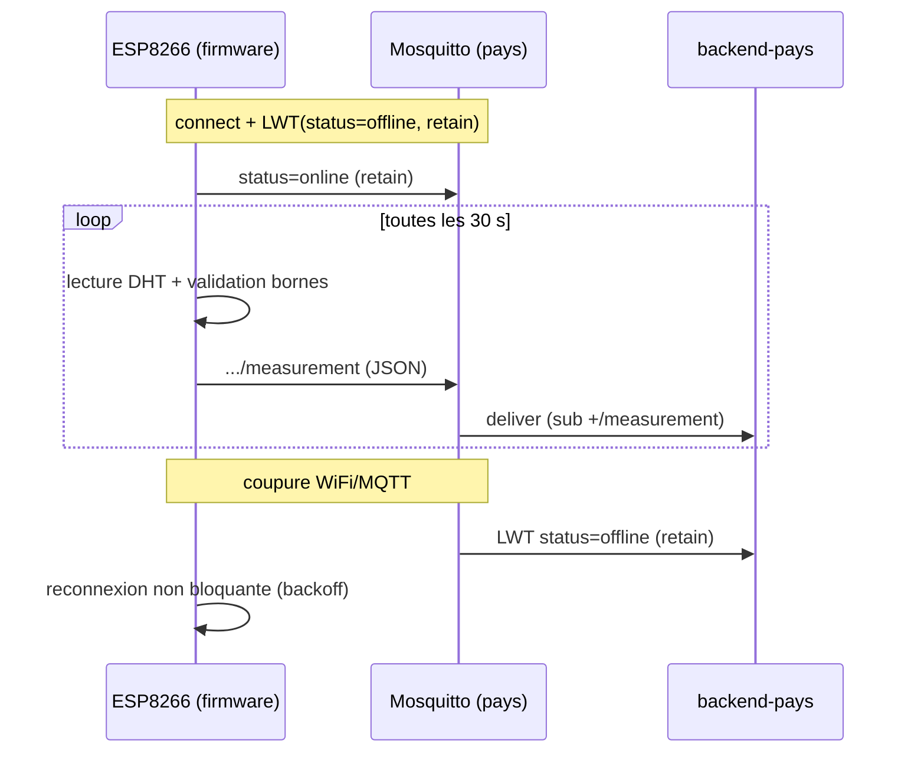

# Firmware IoT (ESP8266 + DHT → MQTT)

## Objectif métier

Doter chaque entrepôt d'un nœud de mesure autonome qui relève la **température**
et l'**humidité** du café vert et les publie en continu vers le `backend-pays`
(CDC §III.2). C'est la source des données qui alimentent l'historique, les
courbes et l'alerting : sans capteur fiable, aucune surveillance des conditions
de stockage.

## Scope

**Inclus (ce PR, #27) :**
- Firmware ESP8266 (`esp12e`) PlatformIO : lecture DHT périodique + publication MQTT.
- Modules séparés (SRP) : `wifi_manager`, `mqtt_client`, `sensor`, `clock_iso`,
  `measurement_json` (logique pure), `topic`, orchestration `main`.
- Reconnexion **WiFi** (backoff exponentiel plafonné) et **MQTT** (retry à chaque
  loop), **non bloquantes** (machine à états `millis()`, aucun `delay()` long).
- LWT (`status=offline` retain) + publication `status=online` à la connexion.
- Horodatage `recordedAt` ISO-8601 UTC via **NTP** (best-effort, omis si non
  synchronisé → le backend horodate).
- Validation des bornes côté capteur (T° -50..80, H 0..100, drop des `NaN`).
- Secrets via `include/secrets.h` (gitignoré) + `secrets.h.example` commité.
- Test unitaire natif (`pio test -e native`) sur la logique pure.
- Câblage documenté : [`../iot/hardware.md`](../iot/hardware.md).

**Hors scope (tickets dédiés) :**
- Subscriber + persistance côté backend → **#28 / #29** (déjà mergés).
- Test d'intégration MQTT broker réel → **#31** (mergé).
- Doc IoT détaillée (`protocol.md`, `firmware.md`) → **#41**.
- Auth MQTT (login/ACL), durcissement prod → **#10 / #50**.
- QoS 1 réel à la publication (PubSubClient = QoS 0) → ADR dédié si nécessaire.

## Parcours utilisateur

- En tant que système, je veux qu'un capteur publie T°/humidité toutes les 30 s
  afin que le backend dispose de données fraîches pour la surveillance.
- En tant qu'exploitant, je veux que le capteur se reconnecte seul après une
  coupure réseau afin de ne pas perdre durablement la télémétrie d'un entrepôt.

## Règles métier

- **Cadence** : `PUBLISH_INTERVAL_MS` = 30 s par défaut (ADR-0003), configurable
  à la compilation.
- **Bornes de validité** : T° ∈ [-50; 80] °C, H ∈ [0; 100] % ; toute lecture
  hors bornes ou `NaN` est **ignorée** (pas de publication).
- **Pas de publication** tant que WiFi **et** MQTT ne sont pas connectés ; aucune
  mise en mémoire tampon hors-ligne (une mesure manquée à 30 s d'intervalle est
  acceptable — ADR-0003).
- **Identité capteur** : `country` + `warehouseId` (depuis `secrets.h`) dérivent
  topic et `clientId` selon ADR-0003 — jamais codés en dur.

## Contrats API / MQTT

| Type | Contrat | Fichier |
|---|---|---|
| MQTT (mesure) | `futurekawa/{country}/warehouse/{id}/measurement` (QoS, retain=false) | `apps/iot/src/topic.h`, `apps/iot/src/mqtt_client.cpp` |
| MQTT (statut) | `futurekawa/{country}/warehouse/{id}/status` (LWT `offline`/`online`, retain) | `apps/iot/src/mqtt_client.cpp` |
| Payload | `{ temperatureCelsius, humidityPercent, recordedAt? }` | `apps/iot/src/measurement_json.cpp` |

Convention figée : [ADR-0003](../adr/0003-mqtt-convention.md). Le pattern de
topic est **dupliqué** côté C++ (`topic.h`) car le firmware ne consomme pas
`@futurekawa/contracts` (ADR-0001) ; un test garantit le format.

## Architecture technique

Points d'attention : reconnexion non bloquante (pas de `delay()` long),
horodatage best-effort (NTP), QoS 0 à la publication (limite PubSubClient,
mitigée par LWT + cadence).

## Implémentation

`apps/iot/` (PlatformIO, **hors workspace pnpm** — pas de `package.json`) :
- **Logique pure (testable natif)** : `src/measurement_json.{h,cpp}`, `src/topic.h`
- **Infra embarquée** : `src/wifi_manager.*`, `src/mqtt_client.*`, `src/sensor.*`, `src/clock_iso.*`
- **Orchestration** : `src/main.cpp`
- **Config / secrets** : `include/config.h`, `include/secrets.h.example`

## Tests

| Niveau | Fichier | Couvre |
|---|---|---|
| Unit (natif) | `apps/iot/test/test_measurement_json/` | sérialisation JSON, bornes, NaN, omission `recordedAt` |
| Unit (natif) | `apps/iot/test/test_topic/` | format topics + clientId (ADR-0003) |
| Intégration | (backend) #31 | débit MQTT + reprise reconnexion broker réel |

Commande : `cd apps/iot && pio test -e native` (sans hardware) ;
`pio run -e esp12e` pour compiler le firmware.

> **Limite matériel** : les critères « flash réel », « connexion < 10 s »,
> « reconnexion à chaud observée », « publication vue via `mosquitto_sub` »
> exigent un ESP8266 + DHT physiques et **ne sont pas vérifiables en CI**. Ils
> sont à valider sur banc matériel par l'équipe.

## Évolutions / TODO

- [ ] Validation sur banc matériel réel (flash + reconnexion + observation MQTT).
- [ ] ADR si bascule vers une lib MQTT supportant QoS 1 à la publication.
- [ ] `docs/iot/protocol.md` + `firmware.md` (ticket #41).
