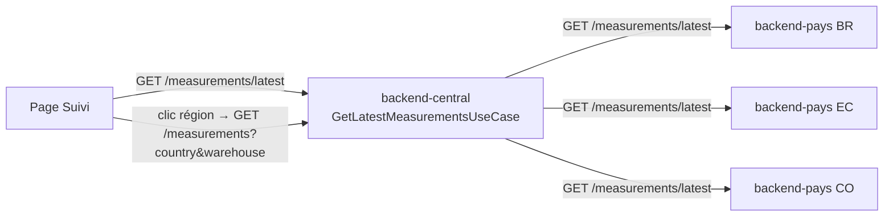

# Relevés T°/humidité par région

## Objectif métier

Donner au siège une vue claire des **conditions de stockage par région** : le
dernier relevé de température et d'humidité de chaque pays, avec horodatage et
mise en évidence des valeurs hors seuils, puis l'historique en courbes au
clic. Répond au besoin de traçabilité et de détection des dérives (CDC §III.2,
§III.3). Réf. ticket : [#143](https://github.com/Enzobu/MSPR-TPRE-814/issues/143).

## Scope

**Inclus :**
- Endpoint central consolidé « dernier relevé par région » (fan-out résilient).
- Endpoint pays « dernier relevé » (sans exiger d'entrepôt).
- Page monitoring front : une carte par région (dernier T°/humidité + horodatage
  + hors-tolérance), état vide et état injoignable explicites.
- Drill-down : au clic sur une région, historique en courbes (réutilise le
  `MeasurementsPanel` existant, alimenté par l'entrepôt du dernier relevé).
- Sélection de région = **pays global de l'app** (sélecteur sidebar, URL `country`).
- Filtre **« Jour »** (URL `day`, date-picker shadcn — ADR-0012) qui restreint
  l'historique à une journée. Le jour est celui du fuseau **local** de
  l'utilisateur, converti en bornes UTC pour l'API (`day-range.ts`).

**Hors scope :**
- Pilotage automatique (chauffage/humidification/aération).
- Modification du firmware IoT et des seuils pays (restent dans contracts).

## Parcours utilisateur

- En tant qu'utilisateur du siège, je vois le dernier relevé T°/humidité de
  chaque région avec son horodatage.
- En tant qu'utilisateur du siège, je repère visuellement une mesure hors
  tolérance (couleur + badge « Hors seuil »).
- En tant qu'utilisateur du siège, je sélectionne une région pour voir
  l'historique de ses courbes.

## Règles métier

- Les seuils/tolérances par pays viennent de `COUNTRY_CONDITIONS`
  (`@futurekawa/contracts`) — jamais redéfinis côté front.
- Un pays **sans relevé** est distinct d'un pays **injoignable** : le premier est
  absent de `data`, le second figure dans `unavailable` (jamais 500, ADR-0007).
- « Dernier relevé » = mesure la plus récente du pays, tous entrepôts confondus.

## Contrats API / MQTT

| Type | Contrat | Fichier |
|---|---|---|
| REST (pays) | `GET /api/v1/measurements/latest` | [`measurements.controller.ts`](../../apps/backend-pays/src/measurements/interface/measurements.controller.ts) |
| REST (siège) | `GET /api/v1/measurements/latest` | [`measurements.controller.ts`](../../apps/backend-central/src/measurements/interface/measurements.controller.ts) |
| Types | `Measurement`, `ConsolidatedList` | [`measurement.ts`](../../packages/contracts/src/measurement.ts), [`pagination.ts`](../../packages/contracts/src/pagination.ts) |

Swagger : `/api-docs#/measurements`. Bruno : `bruno/pays/measurements/latest.bru`,
`bruno/central/measurements/latest.bru`.

## Architecture technique

Le siège fan-out sur les trois pays (`Promise.allSettled`) : chacun renvoie son
dernier relevé (ou null). Fusion → `{ data, unavailable }`. Le drill-down
historique réutilise l'endpoint mesures existant, l'entrepôt provenant du dernier
relevé de la région.

## Implémentation

- **backend-pays** : port [`findLatest`](../../apps/backend-pays/src/measurements/domain/measurement.repository.ts) →
  [`prisma-measurement.repository.ts`](../../apps/backend-pays/src/measurements/infrastructure/prisma-measurement.repository.ts) ;
  [`GetLatestMeasurementUseCase`](../../apps/backend-pays/src/measurements/application/get-latest-measurement.use-case.ts) ;
  route `latest` du [controller](../../apps/backend-pays/src/measurements/interface/measurements.controller.ts).
- **backend-central** : [`GetLatestMeasurementsUseCase`](../../apps/backend-central/src/measurements/application/get-latest-measurements.use-case.ts) ;
  route `latest` du [controller](../../apps/backend-central/src/measurements/interface/measurements.controller.ts).
- **frontend** : [`MonitoringPage`](../../apps/frontend-web/src/pages/MonitoringPage.tsx),
  [`RegionReadingCard`](../../apps/frontend-web/src/features/measurements/components/RegionReadingCard.tsx),
  [`DayFilter`](../../apps/frontend-web/src/features/measurements/components/DayFilter.tsx),
  hooks [`useLatestMeasurements`](../../apps/frontend-web/src/features/measurements/hooks/useLatestMeasurements.ts) /
  [`useMonitoringDay`](../../apps/frontend-web/src/features/measurements/hooks/useMonitoringDay.ts) /
  [`useDashboardCountry`](../../apps/frontend-web/src/features/dashboard/hooks/useDashboardCountry.ts) (région = pays global),
  helper [`dayBounds`](../../apps/frontend-web/src/features/measurements/lib/day-range.ts),
  réutilise [`MeasurementsPanel`](../../apps/frontend-web/src/features/measurements/components/MeasurementsPanel.tsx).

## Tests

| Niveau | Fichier | Couvre |
|---|---|---|
| Unit (pays) | `apps/backend-pays/src/measurements/infrastructure/prisma-measurement.repository.spec.ts` | `findLatest` (orderBy, null) |
| Unit (pays) | `apps/backend-pays/src/measurements/interface/measurements.controller.spec.ts` | route latest (mesure / null) |
| Unit (siège) | `apps/backend-central/src/measurements/application/get-latest-measurements.use-case.spec.ts` | fan-out, null vs unavailable, correlation-id |
| UI | `apps/frontend-web/tests/features/measurements/components/RegionReadingCard.test.tsx` | états + hors-tolérance + sélection |
| UI | `apps/frontend-web/tests/features/measurements/MonitoringPage.test.tsx` | grille, états, sélection via URL/clic, filtre jour, erreur |
| Unit | `apps/frontend-web/tests/features/measurements/lib/day-range.test.ts` | bornes UTC du jour |
| API | `apps/frontend-web/tests/features/measurements/api/measurements.api.test.ts` | `fetchLatestMeasurements` |

## Documentation utilisateur

Lien : [`../user/monitoring.md`](../user/monitoring.md) (section « Suivre les relevés par région »).

## Évolutions / TODO

- [ ] Choix de l'entrepôt quand une région en compte plusieurs (drill-down actuel
      = entrepôt du dernier relevé).
- [ ] Endpoint agrégat (`/aggregate`) pour downsampler les longues séries.
