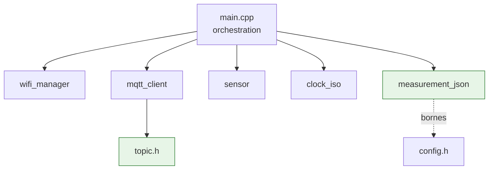
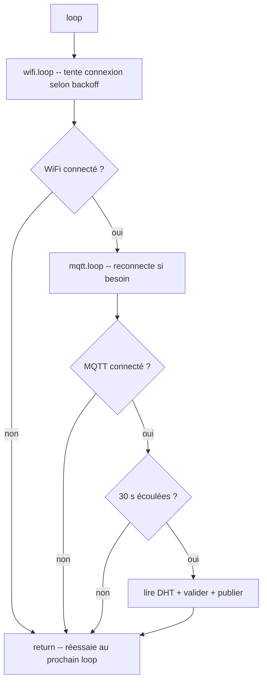
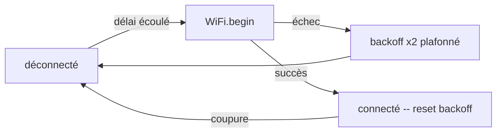

# Architecture du firmware IoT

Firmware embarqué de l'ESP8266 (`esp12e`, PlatformIO/Arduino) qui lit un capteur
DHT et publie les relevés en MQTT selon le [protocole](protocol.md). Ce document
décrit son **architecture interne**, sa **boucle non bloquante** et sa
**stratégie de reconnexion**. Câblage et choix matériel : [`hardware.md`](hardware.md).
Règles de dev embarqué : [`apps/iot/CLAUDE.md`](../../apps/iot/CLAUDE.md).

## Principes directeurs

1. **Une responsabilité par module** (SRP) — `main.cpp` n'orchestre, il ne
   contient aucune logique métier.
2. **Jamais de `delay()` bloquant long** — la boucle progresse via `millis()` et
   des machines à états, pour rester réactive (réseau, capteur) en permanence.
3. **Logique pure isolée** — formatage JSON et construction des topics ne
   dépendent d'aucun header Arduino → testables en natif (`pio test -e native`).
4. **Aucun secret en dur** — credentials et identité capteur dans `secrets.h`
   (gitignoré).

## Modules

| Module | Fichier | Responsabilité |
|---|---|---|
| Orchestration | `src/main.cpp` | `setup()` / `loop()`, enchaînement des états. Zéro logique métier. |
| WiFi | `src/wifi_manager.{h,cpp}` | Connexion + reconnexion **backoff exponentiel** non bloquante. |
| MQTT | `src/mqtt_client.{h,cpp}` | Wrapper PubSubClient : LWT, statut online/offline, publish mesure, reconnexion. |
| Capteur | `src/sensor.{h,cpp}` | Lecture DHT (T°/humidité), propage `NaN` si échec. |
| Horloge | `src/clock_iso.{h,cpp}` | Horodatage ISO-8601 UTC via NTP (best-effort). |
| Sérialisation | `src/measurement_json.{h,cpp}` | Validation des bornes + JSON. **Logique pure.** |
| Topics | `src/topic.h` | Construction topic mesure/statut + clientId (ADR-0003). **Logique pure.** |
| Config | `include/config.h` | Pins, type DHT, cadence, bornes, backoff, NTP. Aucun secret. |
| Secrets | `include/secrets.h` (gitignoré) | WiFi + MQTT + `COUNTRY` + `WAREHOUSE_ID`. |



Les modules **verts** (`measurement_json`, `topic`) sont la logique pure
couverte par les tests natifs.

## Boucle principale (machine à états)

La `loop()` applique des **gardes en cascade** : on ne progresse à l'étape
suivante que si la précédente est satisfaite, sans jamais bloquer.



**Invariant** : aucune publication tant que **WiFi ET MQTT** ne sont pas
connectés. Pas de buffer hors-ligne : une mesure manquée pendant une coupure est
acceptée (intervalle 30 s — ADR-0003).

## Stratégie de reconnexion

### WiFi — backoff exponentiel plafonné

`wifi_manager` ne bloque jamais : à chaque `loop()`, si déconnecté et que le
délai de backoff est écoulé, il (re)lance une tentative et **double** le délai
jusqu'à un plafond.

| Paramètre | Valeur (`config.h`) |
|---|---|
| Délai initial | `WIFI_BACKOFF_MIN_MS` = 500 ms |
| Plafond | `WIFI_BACKOFF_MAX_MS` = 30 s |
| Progression | × 2 à chaque échec |
| Reset | retour à 500 ms dès que connecté |



Le backoff évite de marteler l'AP en cas de coupure prolongée (entrepôt =
structure métallique, atténuation possible) tout en reconnectant vite après une
micro-coupure.

### MQTT — retry espacé non bloquant

`mqtt_client` tente une reconnexion à chaque `loop()` **si déconnecté**, espacée
par `MQTT_RETRY_INTERVAL_MS` (5 s). À la reconnexion :

1. `connect()` déclare le **LWT** (`status=offline`, retain, QoS 1) — le broker
   le publiera tout seul en cas de coupure brutale.
2. En cas de succès, publication immédiate de `status=online` (retain).

## Horodatage

L'ESP8266 n'a pas de RTC : l'heure est synchronisée par **NTP** (`configTime`,
UTC). Tant que NTP n'a pas convergé, `clock_iso` renvoie une chaîne vide → le
champ `recordedAt` est **omis** du payload et le `backend-pays` horodate à la
réception. Sur un site sans accès NTP, tous les horodatages sont donc côté
backend. La fonction de sérialisation reçoit le timestamp **en paramètre**, ce
qui la rend testable indépendamment du temps réel.

## Validation des mesures

Avant publication, `measurement_json::isValid` rejette :

- les lectures `NaN`/`inf` (capteur muet, alim instable) ;
- toute valeur hors bornes (T° ∉ [-50; 80], H ∉ [0; 100]).

Une mesure invalide n'est **pas** publiée (log série, on attend le cycle
suivant). Le capteur ne pollue donc jamais le flux avec du bruit.

## Secrets et identité capteur

`include/secrets.h` (gitignoré, modèle dans `secrets.h.example`) porte :

- `WIFI_SSID` / `WIFI_PASSWORD`
- `MQTT_HOST` / `MQTT_PORT` / `MQTT_USERNAME` / `MQTT_PASSWORD`
- `COUNTRY` (`BR|EC|CO`) + `WAREHOUSE_ID` (ex. `W1`)

Topic et `clientId` sont **dérivés** de `COUNTRY` + `WAREHOUSE_ID` via `topic.h`
(jamais codés en dur), garantissant la conformité ADR-0003.

## Build, test, flash

```bash
cd apps/iot
pio test -e native     # tests unitaires logique pure (sans hardware)
pio run -e esp12e      # compile le firmware (nécessite include/secrets.h)
pio run -t upload      # flashe l'ESP8266 (matériel requis)
pio device monitor     # moniteur série (115200 bauds)
```

> `apps/iot/` est **hors du workspace pnpm** (pas de `package.json`) : n'y lancer
> ni `pnpm` ni `npm` (voir [`apps/iot/CLAUDE.md`](../../apps/iot/CLAUDE.md)).

## Limites

- **QoS 0 à la publication** : `PubSubClient` ne sait pas publier en QoS 1
  (visé par ADR-0003). Mitigé par le LWT + la cadence 30 s. Évolution possible :
  bascule vers une lib MQTT QoS 1 (`256dpi/arduino-mqtt`) → **ADR dédié**.
- **Pas de buffer hors-ligne** : une coupure réseau perd les mesures de la
  fenêtre (choix assumé vu l'intervalle).
- **Horloge** : `recordedAt` dépend de NTP (cf. [Horodatage](#horodatage)).
- **Validation runtime** : lecture DHT réelle, comportement WiFi/MQTT et LWT ne
  sont vérifiables que **sur matériel** (banc de test — ticket #111).

## Références

- Protocole MQTT : [`protocol.md`](protocol.md) · Câblage : [`hardware.md`](hardware.md)
- Convention figée : [ADR-0003](../adr/0003-mqtt-convention.md)
- Règles dev embarqué : [`apps/iot/CLAUDE.md`](../../apps/iot/CLAUDE.md)
- Feature cross-app : [`../features/firmware-iot.md`](../features/firmware-iot.md)
- Validation matériel : ticket #111
