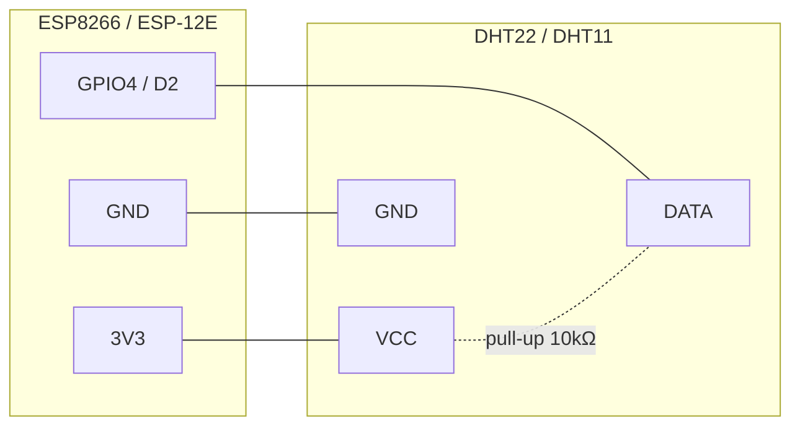

# Matériel IoT — ESP8266 + capteur DHT

Ce document décrit le câblage du nœud de surveillance T°/humidité (CDC §III.2),
les choix matériel et leurs limites. L'architecture du firmware est documentée
dans [`firmware.md`](firmware.md) et le protocole MQTT dans
[`protocol.md`](protocol.md) ; la convention figée est l'[ADR-0003](../adr/0003-mqtt-convention.md).

## Composants

| Composant | Référence | Rôle |
|---|---|---|
| Microcontrôleur | ESP8266 (module ESP-12E / carte NodeMCU) | WiFi + exécution firmware |
| Capteur | DHT22 (AM2302) — fallback DHT11 | mesure température + humidité |
| Résistance | 10 kΩ | pull-up sur la ligne DATA |
| Alimentation | 3.3 V régulée (via USB de la carte) | — |

## Câblage ESP8266 ↔ DHT

La broche DATA du DHT est en collecteur ouvert : elle **exige une résistance de
pull-up 10 kΩ** entre DATA et VCC pour des lectures fiables. Le firmware utilise
`GPIO4` (= `D2` sur NodeMCU) par défaut (`DHT_PIN` dans `apps/iot/include/config.h`).

| Broche DHT | Relié à | Note |
|---|---|---|
| VCC (1) | 3V3 de l'ESP8266 | **3.3 V** — ne pas alimenter en 5 V (logique ESP en 3.3 V) |
| DATA (2) | GPIO4 / D2 | + pull-up 10 kΩ vers VCC |
| NC (3) | — | non connectée (DHT22) |
| GND (4) | GND de l'ESP8266 | masse commune |



ASCII équivalent :

```
   ESP8266                       DHT22
  +--------+                   +--------+
  |   3V3  |-------+---------->| VCC    |
  |        |       |           |        |
  |        |     [10kΩ]        |        |
  |        |       |           |        |
  |  GPIO4 |-------+---------->| DATA   |
  |        |                   |        |
  |   GND  |------------------>| GND    |
  +--------+                   +--------+
```

## Choix matériel : DHT22 vs DHT11

| Critère | DHT22 (AM2302) — **préféré** | DHT11 — fallback campus |
|---|---|---|
| Plage température | -40 à +80 °C | 0 à +50 °C |
| Précision température | ±0.5 °C | ±2 °C |
| Plage humidité | 0–100 % | 20–80 % |
| Précision humidité | ±2–5 % | ±5 % |
| Fréquence d'échantillonnage | 0.5 Hz (1 lecture / 2 s) | 1 Hz |
| Coût | plus élevé | faible |

Le **DHT22** est retenu par défaut : sa plage et sa précision couvrent mieux le
suivi de café vert (alertes fines). Le **DHT11** reste un fallback si c'est le
seul modèle disponible sur le stock campus — basculer via le `#define DHT_TYPE`
dans `apps/iot/include/config.h` (`DHT22` → `DHT11`).

> La cadence d'émission firmware (30 s, `PUBLISH_INTERVAL_MS`) est très en deçà
> de la fréquence max du capteur : aucune contrainte côté échantillonnage.

## Limites et risques (CDC §IV.4.2)

- **Pas d'horloge RTC fiable** : l'ESP8266 perd l'heure à chaque reset. Le
  firmware synchronise l'heure par **NTP** (`configTime`) pour produire le
  `recordedAt` ISO-8601. Tant que NTP n'a pas convergé, `recordedAt` est **omis**
  et c'est le `backend-pays` qui horodate à la réception (best-effort, ADR-0003).
  Sur un site sans accès NTP, tous les horodatages seront côté backend.
- **Alimentation** : le DHT doit être en **3.3 V** (logique ESP). Une alimentation
  USB instable peut provoquer des lectures `NaN` ; le firmware les filtre et
  n'émet pas de mesure invalide. Prévoir un condensateur de découplage 100 nF
  près du DHT en environnement bruité.
- **Portée WiFi terrain** : entrepôt = structure métallique, possible atténuation.
  Le firmware gère une **reconnexion WiFi à backoff exponentiel** et une
  **reconnexion MQTT** non bloquantes ; une mesure manquée pendant une coupure
  est acceptable (intervalle 30 s, pas de buffer hors-ligne — ADR-0003).
- **QoS MQTT** : la lib `PubSubClient` ne publie qu'en **QoS 0** alors que
  l'ADR-0003 vise QoS 1. Mitigation : LWT (`status` retain) + publication
  fréquente. Détail et évolution possible : [`firmware.md`](firmware.md#limites).
- **Longueur de câble DATA** : garder le DHT proche de l'ESP (< 20 cm) sans
  pull-up renforcé ; au-delà, réduire la valeur de pull-up ou rapprocher le
  capteur.

## Références

- ADR-0003 — convention MQTT (topics, payload, QoS, fréquence) :
  [`../adr/0003-mqtt-convention.md`](../adr/0003-mqtt-convention.md)
- Firmware (archi) : [`firmware.md`](firmware.md) · Protocole MQTT : [`protocol.md`](protocol.md)
- Feature cross-app : [`../features/firmware-iot.md`](../features/firmware-iot.md)
- Config matérielle : `apps/iot/include/config.h`
- Datasheet DHT11 : `apps/iot/doc/DHT11.PDF`
