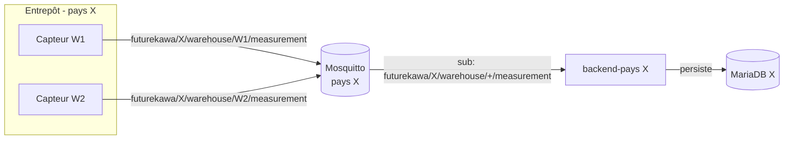
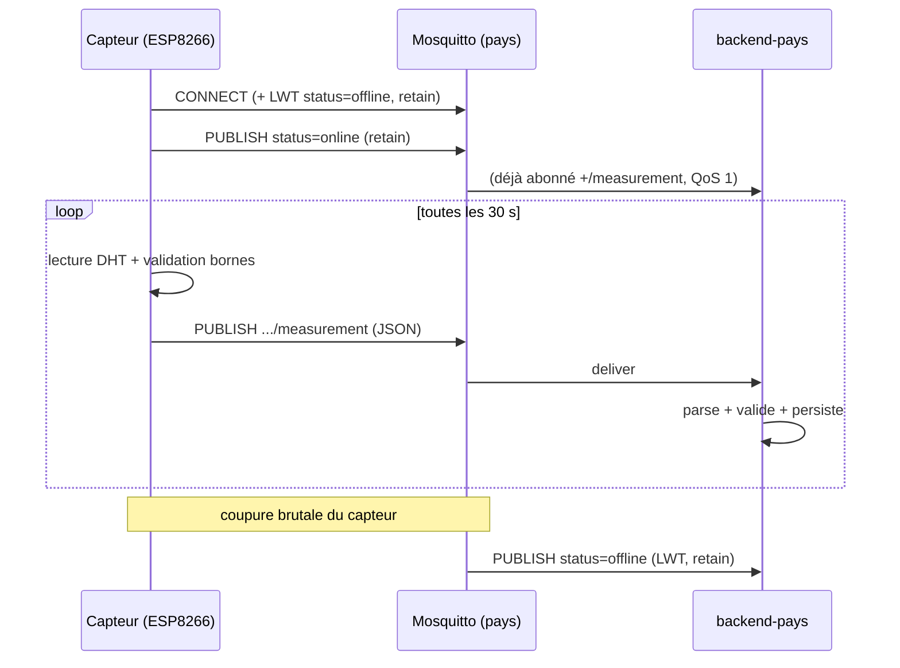

# Protocole MQTT IoT

Ce document décrit **le contrat d'échange** entre le capteur (producteur) et le
`backend-pays` (consommateur) : topics, format des messages, qualité de service
et fréquences. Il est l'application concrète de l'[ADR-0003](../adr/0003-mqtt-convention.md),
qui en est la **source de vérité** ; toute évolution du contrat passe par un ADR.

- **Producteur** : firmware ESP8266 → voir [`firmware.md`](firmware.md).
- **Consommateur** : subscriber `backend-pays` (`apps/backend-pays/src/measurements/infrastructure/mqtt-measurement.subscriber.ts`).
- **Transport** : un broker **Mosquitto par pays** (ADR-0001), TCP 1883.

## Vue d'ensemble



Chaque capteur publie sur **son propre** topic d'entrepôt ; le backend s'abonne
avec un **wildcard `+`** scopé à son pays et ne voit donc jamais les autres pays.

## Topics

La convention de nommage est figée et **identique** des deux côtés. Le firmware
la duplique en C++ (`apps/iot/src/topic.h`) car il ne peut pas importer le
package TypeScript ; le backend la dérive de `@futurekawa/contracts`
(`measurementTopic`, `measurementSubscriptionTopic`). Un test de chaque côté
garantit le format.

| Usage | Topic | Qui publie | Qui s'abonne |
|---|---|---|---|
| Mesure | `futurekawa/{country}/warehouse/{warehouseId}/measurement` | capteur | backend (wildcard) |
| Statut (LWT) | `futurekawa/{country}/warehouse/{warehouseId}/status` | capteur / broker | superviseur |
| Abonnement backend | `futurekawa/{country}/warehouse/+/measurement` | — | backend |

**Segments :**

- `{country}` ∈ `BR | EC | CO` — le `CountryCode` de `@futurekawa/contracts`.
- `{warehouseId}` = `code` de l'entrepôt (ex. `W1`). Il est porté par le **topic**,
  **jamais** par le payload de mesure.

## Payload de mesure

Publié sur `.../measurement`, en JSON UTF-8.

```json
{
  "temperatureCelsius": 28.5,
  "humidityPercent": 56.2,
  "recordedAt": "2026-04-17T14:32:00Z"
}
```

| Champ | Type | Contrainte | Obligatoire |
|---|---|---|---|
| `temperatureCelsius` | number | fini, **-50 à 80** | oui |
| `humidityPercent` | number | fini, **0 à 100** | oui |
| `recordedAt` | string | ISO-8601 UTC (suffixe `Z`) | **optionnel** |

- **`recordedAt` optionnel** : l'ESP8266 n'a pas d'horloge fiable. Tant que NTP
  n'a pas synchronisé l'heure, le champ est **omis** et le `backend-pays`
  horodate à la réception (best-effort). Voir [`firmware.md`](firmware.md#horodatage).
- **Bornes partagées** : les mêmes constantes (`TEMPERATURE_CELSIUS_MIN/MAX`,
  `HUMIDITY_PERCENT_MIN/MAX`) bornent la validation côté capteur **et** côté
  backend. Une mesure hors bornes ou `NaN` n'est jamais publiée par le capteur,
  et serait droppée par le backend si elle arrivait.
- Le backend **reconstruit** la `Measurement` complète : `warehouseId` (topic) +
  `country` (instance) + payload.

### Cohérence avec le contrat REST

Le payload MQTT correspond à `IngestMeasurementDto` de `@futurekawa/contracts`
**moins** `warehouse` (porté par le topic). Le fallback REST
`POST /api/v1/measurements` accepte, lui, le DTO complet (`warehouse` dans le
body). Mêmes bornes des deux côtés.

## Payload de statut (LWT)

Publié sur `.../status`, en texte brut, **retain = true** :

| Valeur | Émis par | Quand |
|---|---|---|
| `online` | capteur | juste après une connexion MQTT réussie |
| `offline` | **broker** (LWT) | déconnexion brutale du capteur détectée par le broker |

Le `retain = true` permet à un superviseur qui se connecte **après coup** de
connaître immédiatement l'état courant de chaque capteur.

## QoS, retain, clientId, fréquence

| Paramètre | Valeur | Justification |
|---|---|---|
| QoS mesure | **1** (at-least-once) | Réseau terrain variable : la livraison prime. Doublons dédupliquables par `(warehouseCode, recordedAt)`. |
| retain mesure | **false** | Une mesure est un **événement** horodaté, pas un état. |
| retain statut | **true** | L'état online/offline est un **état courant**. |
| clientId capteur | `futurekawa-iot-{country}-{warehouseId}` | Unique par capteur → pas d'éviction de session. |
| clientId backend | `{MQTT_CLIENT_ID}-sub` | Distinct du producteur. |
| Fréquence | **30 s** (`PUBLISH_INTERVAL_MS`) | Compromis fraîcheur / charge réseau / usure flash. Configurable. |

> ⚠️ **Limite QoS connue** : la lib firmware `PubSubClient` publie en **QoS 0**,
> alors que le contrat vise QoS 1. Mitigation : LWT + cadence courte (30 s). Le
> backend, lui, **s'abonne bien en QoS 1**. Un passage à une lib firmware
> supportant QoS 1 ferait l'objet d'un ADR. Détail :
> [`firmware.md`](firmware.md#limites).

## Séquence nominale



## Déduplication

QoS 1 garantit *au moins une* livraison → des **doublons sont possibles**. Si une
unicité stricte devient nécessaire, dédupliquer sur la clé métier
`(warehouseCode, recordedAt)`. À 30 s d'intervalle, l'impact pratique est faible.

## Robustesse côté consommateur

Le subscriber `backend-pays` est conçu pour ne **jamais** crasher sur le flux
MQTT :

- **Boot non bloquant** si le broker est down (`reconnectPeriod` = 2 s → reconnexion auto).
- **Message invalide** (topic/payload non conforme) → log `warn` + **drop**, jamais d'exception remontée.
- **Échec de persistance** → log `error` + drop, le flux continue.

La stratégie de reconnexion **côté capteur** est décrite dans
[`firmware.md`](firmware.md#stratégie-de-reconnexion).

## Références

- Convention figée : [ADR-0003](../adr/0003-mqtt-convention.md)
- Architecture distribuée (un broker par pays) : [ADR-0001](../adr/0001-distributed-architecture.md)
- Firmware (producteur) : [`firmware.md`](firmware.md) · Câblage : [`hardware.md`](hardware.md)
- Code producteur : `apps/iot/src/mqtt_client.cpp`, `apps/iot/src/topic.h`
- Code consommateur : `apps/backend-pays/src/measurements/infrastructure/mqtt-measurement.subscriber.ts`
- Helpers de topic partagés : `packages/contracts/src/mqtt.ts`
