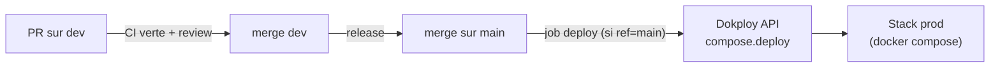

# Déploiement

Procédure de déploiement de la solution, du **local** à la **production**. La
CI/CD repose sur **GitHub Actions** (`.github/workflows/ci.yml`), le déploiement
est délégué à **Dokploy** (orchestrateur Docker Compose). Le détail des jobs du
pipeline est dans [`../ci-cd/github-actions.md`](../ci-cd/github-actions.md).

## Vue d'ensemble



- **`dev`** : intégration continue (build + tests + e2e + Sonar). **Pas** de déploiement.
- **`main`** : le job `deploy` se déclenche (`if: github.ref == 'refs/heads/main'`)
  et appelle l'API Dokploy qui redéploie le `docker-compose` de prod.

## 1. Déploiement local (toute la stack)

```bash
cp .env.compose.example .env.compose   # renseigner les valeurs
docker compose --env-file .env.compose build
docker compose --env-file .env.compose up -d
```

Vérifier :

```bash
docker compose ps
curl -fsS http://localhost:${BACKEND_CENTRAL_PORT}/ready
# UI : http://localhost:${FRONTEND_WEB_PORT}
```

> Reproduire le build « comme la CI » : `pnpm -r build` puis
> `docker compose build`.

## 2. Déploiement en production

Le déploiement prod est **automatique** sur `main` :

1. Ouvrir une PR vers `dev`, faire passer la CI + review, merger.
2. Quand une release est prête, merger `dev` → `main` (via PR).
3. Le job **`deploy`** (GitHub Actions) s'exécute après `sonarqube` et appelle :

   ```bash
   curl -X POST "https://<dokploy>/api/compose.deploy" \
     -H "x-api-key: $DOKPLOY_API_KEY" \
     -H "Content-Type: application/json" \
     -d '{"composeId":"<DOKPLOY_COMPOSE_ID>"}'
   ```

4. Dokploy reconstruit et redémarre la stack `docker-compose` de prod.

### Secrets requis (GitHub → Settings → Secrets)

| Secret | Usage |
|---|---|
| `DOKPLOY_API_KEY` | Authentifie l'appel de déploiement |
| `DOKPLOY_COMPOSE_ID` | Identifie la stack compose à redéployer |
| `SONAR_TOKEN`, `SONAR_HOST_URL` | Analyse SonarQube (job précédent) |

### Variables d'environnement de prod

Le `docker-compose.yml` est entièrement **paramétré par variables** (voir
`.env.compose.example`) : ports, DB (`DATABASE_*_URL`), MQTT (`MQTT_*`), SMTP
(`SMTP_*`, `ALERT_*`), CORS (`*_CORS_ORIGIN`), JWT (`JWT_*`). En prod, ces valeurs
viennent de l'environnement Dokploy, **jamais** du dépôt. Durcissement prod
(secrets hors-image, TLS, CSP) : ticket #50.

> ⚠️ Le `docker-compose.yml` versionné fixe `JWT_SECRET=change-me-for-local-compose-only`
> pour le local : **doit être surchargé** en prod par un vrai secret.

## 3. Preuve d'exécution (jury)

> 📸 **À compléter (#51)** : insérer ici une capture d'un run GitHub Actions vert
> (workflow `Build`) et un extrait de log du job `deploy` (code HTTP 2xx renvoyé
> par l'API Dokploy). Cette étape nécessite un accès au dépôt GitHub / Dokploy et
> est réalisée par l'équipe.

## 4. Rollback

En cas de déploiement défaillant :

1. **Re-déployer la version précédente** : remettre `main` sur le dernier commit
   stable puis relancer le déploiement.

   ```bash
   git revert <commit-fautif>   # ou reset sur le tag stable, via PR
   # le merge sur main relance le job deploy
   ```

2. **Rollback côté Dokploy** : redéployer le `composeId` sur l'image/tag stable
   précédent depuis l'interface Dokploy (ou rappeler `compose.deploy` après avoir
   pointé sur la version antérieure).
3. **Vérifier** : `/ready` des backends + UI + flux MQTT (voir
   [`runbook.md`](runbook.md)).

> 🔁 **Rollback à tester (#51)** : valider la procédure sur l'environnement réel
> et joindre la preuve.

## 5. Checklist « avant mise en prod » (CDC §V.2, OWASP API Top 10)

Config prod de référence : `apps/backend-central/.env.example.prod`,
`apps/backend-pays/.env.example.prod` (#50).

**Secrets & environnement**
- [ ] `NODE_ENV=production` sur les deux backends.
- [ ] Tous les secrets (`DB`, `JWT_SECRET` ≥ 32 car., `MQTT_*`, `SMTP_*`) fournis
      par le gestionnaire de secrets du CI/CD — **aucun** en clair dans le dépôt.
- [ ] `JWT_SECRET` distinct du local (le `docker-compose.yml` fixe une valeur
      `change-me-for-local-compose-only` → **surchargée** en prod).
- [ ] Identifiants du seed ADMIN forts et changés après le premier login.

**Réseau & en-têtes**
- [ ] `CORS_ORIGIN` = origine(s) HTTPS exacte(s), **jamais `*`** (vérifié sur les 2 backends).
- [ ] **CSP** active (en-tête `Content-Security-Policy` servi par Nginx) et
      `connect-src` restreint à l'origine réelle de l'API → **0 erreur console** au
      chargement (à vérifier dans le navigateur sur l'image buildée).
- [ ] En-têtes de sécurité présents : `X-Content-Type-Options`, `X-Frame-Options`,
      `Referrer-Policy`, `Permissions-Policy` (cf. `apps/frontend-web/nginx.conf`).
- [ ] HTTPS de bout en bout (TLS au niveau du reverse proxy / Dokploy).

**Auth & cookies**
- [ ] Cookie de refresh `fk_refresh` : `httpOnly` + `Secure` + `SameSite=Strict`
      (auto en prod via `isProduction`, cf. `refresh-cookie.ts`).
- [ ] Tokens d'accès **en mémoire** côté front (jamais `localStorage`).

**Robustesse & limites**
- [ ] Rate limiting resserré (`THROTTLE_LIMIT`/`THROTTLE_TTL_MS`) selon la charge attendue.
- [ ] Broker MQTT : `allow_anonymous false`, credentials prod, ACL par pays.
- [ ] `/health` et `/ready` répondent ; healthchecks Docker actifs.
- [ ] Erreurs normalisées RFC 7807, **aucune** stacktrace renvoyée au client.
- [ ] Logs en `LOG_LEVEL=info`, sans secret.

## Références

- Pipeline détaillé : [`../ci-cd/github-actions.md`](../ci-cd/github-actions.md)
- Images & compose : [`../ci-cd/docker.md`](../ci-cd/docker.md)
- Opérations courantes : [`runbook.md`](runbook.md)
- Architecture distribuée : [`../architecture/distributed.md`](../architecture/distributed.md)
- Pipeline : `.github/workflows/ci.yml`
