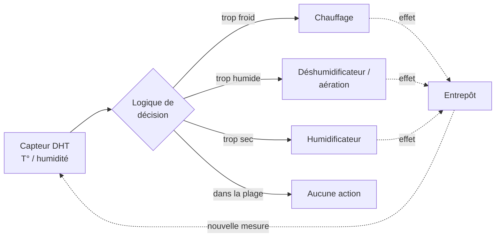
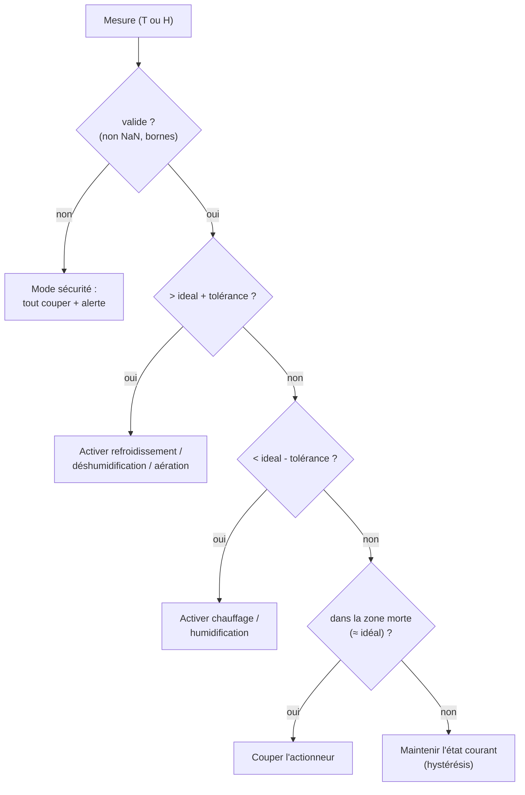

# Schéma d'automatisation — prototype phase 2

En **phase 1**, la solution **surveille** la température et l'humidité et **alerte**
(passif). La **phase 2** (CDC §III.6, §IV.9) ajoute la **régulation active** :
des **actionneurs** (chauffage, humidification/déshumidification, aération)
ramènent automatiquement les conditions dans la plage idéale du pays. Ce document
est un **prototype de schéma de principe** : il décrit la boucle de régulation,
la logique de décision, les sécurités et les cas dégradés. Il ne décrit pas une
implémentation finale.

> ⚠️ **Statut : prototype/draft.** Sert de base de cadrage. Le matériel
> d'actionnement (relais, résistances, humidificateurs, ventilateurs) et le
> dimensionnement réel sont hors scope de la phase 1.

## Vue d'ensemble — boucle de régulation

La phase 2 transforme la chaîne **ouverte** (capteur → mesure → alerte) en une
**boucle fermée** (capteur → décision → actionneur → effet physique → capteur).



## Consigne : la plage idéale par pays

La régulation vise la **plage tolérée** déjà définie en phase 1 — source unique
de vérité `COUNTRY_CONDITIONS` de `@futurekawa/contracts`, **jamais** redéfinie ici :

| Pays | T° idéale | Tolérance T° | Humidité idéale | Tolérance H |
|---|---|---|---|---|
| Brésil (BR) | 29 °C | ± 3 °C | 55 % | ± 2 % |
| Équateur (EC) | 31 °C | ± 3 °C | 60 % | ± 2 % |
| Colombie (CO) | 26 °C | ± 3 °C | 80 % | ± 2 % |

> Réutiliser les **mêmes seuils** que l'alerting (ADR-0004) garantit la cohérence :
> on régule pour rester dans la zone qui, sinon, déclencherait une alerte.

## Logique de décision

Évaluée à chaque relevé, **indépendamment** pour la température et l'humidité.
Pour éviter que les actionneurs ne s'allument/s'éteignent en rafale autour de la
limite (**court-cycle**), on applique une **hystérésis** : on **active** à la
sortie de la plage tolérée, mais on ne **désactive** qu'au retour près de la
valeur idéale (zone morte interne).



Pseudo-code (par grandeur régulée) :

```text
regulate(value, ideal, tolerance, state):
    if not isValid(value):            # NaN, hors bornes capteur
        return SAFE_STOP              # cf. sécurités
    high = ideal + tolerance
    low  = ideal - tolerance
    deadband = ideal ± (tolerance / 2)   # zone morte interne (anti court-cycle)

    if value > high:    return ACTUATOR_DOWN   # refroidir / déshumidifier / aérer
    if value < low:     return ACTUATOR_UP     # chauffer / humidifier
    if value in deadband:  return OFF          # revenu près de l'idéal → couper
    return state                                # entre deadband et limite → garder
```

Mapping actionneurs :

| Grandeur | Trop haute → | Trop basse → |
|---|---|---|
| Température | refroidissement / aération | chauffage |
| Humidité | déshumidification / aération | humidification |

## Sécurités

La régulation **n'aggrave jamais** la situation et **échoue en sécurité** :

1. **Hystérésis / zone morte** : pas de court-cycle des actionneurs (usure, à-coups).
2. **Anti-court-cycle temporel** : durée minimale entre deux commutations d'un même
   actionneur (`MIN_TOGGLE_INTERVAL`).
3. **Bornes physiques de sécurité** : si une mesure dépasse un seuil critique
   (au-delà de la tolérance métier), priorité à la mise en sécurité (couper le
   chauffage, forcer l'aération) + alerte.
4. **Arrêt d'urgence logique** : un drapeau coupe **tous** les actionneurs et
   bascule en mode surveillance seule (déclenchable manuellement ou par défaut
   capteur).
5. **Mode manuel / auto** : un opérateur peut **reprendre la main** (manuel) ; en
   auto, la boucle régule. Le mode est explicite et journalisé.
6. **Exclusion mutuelle** : ne jamais chauffer et refroidir simultanément (ni
   humidifier et déshumidifier) — la décision est exclusive par grandeur.
7. **Watchdog** : sans mesure fraîche depuis `MAX_SENSOR_SILENCE`, on coupe les
   actionneurs (on ne régule pas à l'aveugle) + alerte.

## Cas nominal

1. Le capteur publie une mesure (phase 1, MQTT — ADR-0003).
2. La logique compare à la plage du pays.
3. Si hors plage, l'actionneur adéquat est commandé ; sinon rien.
4. L'effet physique ramène progressivement la grandeur vers l'idéal.
5. À l'entrée dans la zone morte, l'actionneur est coupé.

## Cas dégradés

| Situation | Détection | Réaction |
|---|---|---|
| **Capteur défaillant** (NaN, valeurs aberrantes) | validation bornes (phase 1) | `SAFE_STOP` : couper les actionneurs, ne pas réguler à l'aveugle, alerter |
| **Capteur muet** (plus de mesure) | watchdog `MAX_SENSOR_SILENCE` | couper les actionneurs + alerte |
| **Alimentation perdue** (module/actionneur) | absence d'effet / état inconnu au redémarrage | démarrage en **état sûr** (tout coupé, mode surveillance) puis re-régulation |
| **Actionneur bloqué** (la grandeur ne bouge pas malgré la commande) | dérive persistante au-delà d'un délai | alerte maintenance + maintien en sécurité |
| **Réseau/MQTT coupé** | reconnexion (phase 1) | pas de pilotage distant ; la décision doit pouvoir rester **locale** (cf. intégration) |

## Intégration avec la solution existante

La phase 2 **réutilise** la chaîne de la phase 1, sans la dupliquer :

- **Capteurs & MQTT** : mêmes relevés, même convention de topics (ADR-0003). On
  ajoute un topic de **commande** actionneur (ex. `futurekawa/{country}/warehouse/{id}/command`)
  et un topic d'**état** actionneur — à figer dans un **futur ADR**.
- **Seuils** : `COUNTRY_CONDITIONS` (`@futurekawa/contracts`), partagés avec l'alerting.
- **Décision** : deux options à trancher (ADR phase 2)
  - **embarquée** (sur l'ESP8266) → résiliente au réseau, mais logique figée dans le firmware ;
  - **côté `backend-pays`** → logique centralisée/évolutive, mais dépend du réseau local.
  > Recommandation prototype : décision **locale** (robustesse terrain, CDC §III.5),
  > supervision et override depuis le backend.
- **Observabilité** : commandes et changements d'état journalisés (pino) + visibles
  à terme dans l'UI (mode auto/manuel, état des actionneurs).

## À trancher (ADR phase 2)

- [ ] Convention MQTT des commandes/états actionneurs (topics, payload, QoS, retain).
- [ ] Lieu de la décision (embarquée vs backend) + override manuel.
- [ ] Matériel d'actionnement et sécurités électriques (hors logiciel).
- [ ] Constantes : `deadband`, `MIN_TOGGLE_INTERVAL`, `MAX_SENSOR_SILENCE`.

## Références

- CDC : §III.6 (automatisation), §IV.9 (phase 2).
- Seuils : `packages/contracts/src/country.ts` (`COUNTRY_CONDITIONS`).
- Convention MQTT phase 1 : [ADR-0003](../adr/0003-mqtt-convention.md).
- Alerting (mêmes seuils) : [ADR-0004](../adr/0004-alerting-strategy.md).
- IoT phase 1 : [`../iot/firmware.md`](../iot/firmware.md), [`../iot/protocol.md`](../iot/protocol.md).
