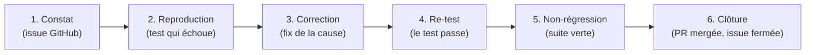

# Gestion des anomalies

Process de traitement d'une anomalie (bug, écart au comportement attendu)
détectée par un test, en revue ou en démo : du **constat** à la **correction**
vérifiée par **re-test**. S'appuie sur la méthode test-first de la commande
[`/fix`](../../.claude/commands/fix.md).

## Cycle de vie



### 1. Constat

- Ouvrir une **issue GitHub** label `bug` (+ scope : `pays`/`central`/`front`/`iot`).
- Décrire : contexte, étapes, résultat observé vs attendu, sévérité.

### 2. Reproduction (test-first)

- Écrire un **test qui échoue** reproduisant l'anomalie (unitaire de préférence ;
  intégration/e2e si la cause traverse un système externe).
- Ce test devient la **preuve** : il échoue *avant* le fix, passe *après*.

### 3. Correction

- Corriger la **cause**, jamais le symptôme. **Interdit** de modifier l'assertion
  pour faire passer un test (anti-pattern ADR-0008).
- Respecter la clean archi et les règles `/rules`.

### 4. Re-test

- Le test de l'étape 2 **passe**.
- Lancer la suite de la zone touchée (`pnpm --filter <app> test`, e2e si concerné).

### 5. Non-régression

- `pnpm -r test` vert (+ Playwright / e2e backend si la zone est concernée).
- Vérifier les contrats partagés (`@futurekawa/contracts`) si touchés.

### 6. Clôture

- PR liée à l'issue (Conventional Commit `fix(...)`), revue par un pair, mergée.
- Fermer l'issue avec un commentaire renvoyant à la PR et au test ajouté.

## Sévérités

| Sévérité | Définition | Délai cible |
|---|---|---|
| **Bloquante** | Fonction critique indisponible / perte de données / alerte non levée | immédiat |
| **Majeure** | Parcours dégradé sans contournement | sprint courant |
| **Mineure** | Gêne avec contournement | backlog priorisé |
| **Cosmétique** | UI/wording sans impact fonctionnel | opportuniste |

## Tests flaky

Un test instable est traité comme une anomalie : **quarantaine temporaire**
(annotée + tracée par une issue) puis **fix prioritaire**. On ne tolère pas un
flaky « qui passe au retry ».

## Gabarit de rapport d'anomalie

```markdown
### Anomalie — <titre court>

- **ID / issue** : #NNN
- **Date** : YYYY-MM-DD
- **Détecté par** : test auto / revue / démo / utilisateur
- **Sévérité** : bloquante | majeure | mineure | cosmétique
- **Scope** : pays | central | front | iot | contracts

**Contexte / étapes de reproduction**
1. ...
2. ...

**Résultat observé**
...

**Résultat attendu**
...

**Cause identifiée**
...

**Correction (PR)**
- PR : #NNN
- Test de non-régression ajouté : `chemin/vers/le.spec.ts`

**Vérification**
- [ ] Test de repro échoue avant le fix
- [ ] Test passe après le fix
- [ ] Suite de la zone verte
- [ ] Pas de régression (`pnpm -r test`)
```

## Références

- [ADR-0008 — Stratégie de tests](../adr/0008-testing-strategy.md)
- Commande [`/fix`](../../.claude/commands/fix.md) (méthode test-first)
- Stratégie : [`strategy.md`](strategy.md) · Plan : [`test-plan.md`](test-plan.md)
