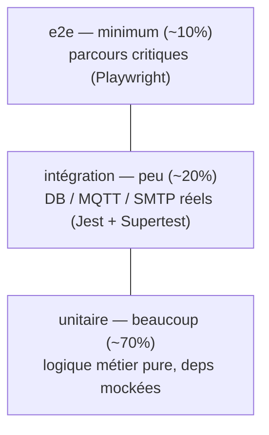

# Stratégie de tests

La décision de fond (pyramide, outils, cible de couverture, isolation) est figée
par [ADR-0008](../adr/0008-testing-strategy.md). Cette page la **résume** et donne
le mode d'emploi concret (commandes, environnement). Les cas de test détaillés
sont dans [`test-plan.md`](test-plan.md).

## Pyramide



Plus on monte, moins il y a de tests et plus ils sont lents/fragiles. L'effort
porte sur l'**unitaire** rapide ; l'**e2e** est réservé aux parcours critiques.

## Outils par stack

| Stack | Unitaire / composant | Intégration | e2e |
|---|---|---|---|
| **backend-pays** | Jest (`pnpm test`) | Jest + Supertest (`test:e2e`) — DB + MQTT + SMTP réels | — |
| **backend-central** | Jest | Jest + Supertest (gateway HTTP, pays mocké) | — |
| **frontend-web** | Vitest + @testing-library/react | — | Playwright |
| **iot (C++)** | `pio test -e native` (logique pure) | — | — |
| **parcours global** | — | — | Playwright (FIFO, alerting MQTT→email) |

## Commandes

```bash
# Unitaires (depuis la racine, tous workspaces)
pnpm -r test
pnpm --filter backend-pays test:cov     # avec couverture (lcov → Sonar)

# Front : composant + e2e
pnpm --filter frontend-web test          # Vitest
pnpm --filter frontend-web test:e2e      # Playwright (réseau mocké)

# IoT (hors pnpm)
cd apps/iot && pio test -e native

# Intégration backend (DB/MQTT/SMTP réels)
docker compose -f docker-compose.test.yml up -d
pnpm --filter backend-pays test:e2e
docker compose -f docker-compose.test.yml down
```

## Environnement d'intégration

`docker-compose.test.yml` fournit les dépendances réelles, isolées de la stack de
dev :

| Service | Image | Port | Rôle |
|---|---|---|---|
| `mariadb-test` | MariaDB (tmpfs) | 3399 | DB jetable (migrations au boot) |
| `mosquitto-test` | Mosquitto | 1893 | Broker MQTT de test |
| `maildev-test` | MailDev | SMTP 1026 / API 1081 | Capture des emails d'alerte |

**Conventions d'isolation :**

- Préfixe de données `IT-` + cleanup `before/after` → pas d'état partagé entre suites.
- `test:e2e` tourne en `maxWorkers: 1` (+ `NODE_OPTIONS=--experimental-vm-modules`).
- Les e2e front (Playwright) **mockent le réseau** (`page.route`) → aucun backend requis.

> ⚠️ **Limite connue (e2e backend)** : `apps/backend-pays/test/setup-e2e.ts`
> charge l'env via `process.loadEnvFile`, qui n'alimente pas le `process.env` du
> sandbox VM de Jest. En conséquence, certains e2e tournent contre la DB de dev
> au lieu de la stack de test, **sauf** quand la spec hardcode l'env en tête de
> fichier (pattern à réutiliser). Un correctif est traité à part.
>
> ⚠️ La **CI n'exécute pas l'e2e backend** (qui exige Docker) : le job `tests`
> couvre l'unitaire backend + front, le job `e2e` couvre Playwright front. Les
> e2e backend sont **locaux**.

## Couverture

Pas d'objectif 100 %. Couverture **exigée sur les zones critiques** (voir
[`test-plan.md`](test-plan.md)) :

- seuils d'alerte T°/humidité par pays + déduplication + péremption 365 j ;
- tri FIFO des lots ;
- persistance des mesures MQTT (valide persisté / invalide droppé) ;
- contrats HTTP pays ↔ siège + réponse partielle `{ data, unavailable }`.

`jest --coverage` produit `lcov.info`, remonté à **SonarQube** par la CI. Le
quality gate évalue le **new code** ; il peut rester rouge sur une PR de
doc/squelette — comportement attendu.

## Conventions

- **AAA** (Arrange / Act / Assert), un comportement par test.
- **Nommage impératif anglais** : `should reject lot older than 365 days`.
- `describe('<SUT>', …)` préfixé par le nom du sujet testé.

## Anti-patterns refusés

- ❌ Supprimer un test pour le faire passer.
- ❌ Tolérer un test flaky (quarantaine + fix prioritaire).
- ❌ Mocks qui figent l'implémentation au lieu du comportement.

## Références

- [ADR-0008 — Stratégie de tests](../adr/0008-testing-strategy.md)
- Règle transverse : [`04-tests.md`](../../.claude/rules/04-tests.md)
- Plan détaillé : [`test-plan.md`](test-plan.md) · Anomalies : [`anomalies.md`](anomalies.md)
